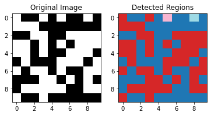
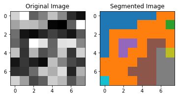
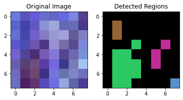

# **Labeling regions in colored images**

# **Introduction**

Region labeling is the process of assigning unique labels to different
regions or segments in an image. It is an important step in scene
segmentation, which is the process of dividing an image into multiple
segments or regions based on the similarity of their properties, such as
color, texture, or shape.  
Region labeling is important for scene interpretation because it allows
us to distinguish between different objects or regions in the image,
which can then be used for further analysis and understanding of the
scene. For example, in the field of computer vision, region labeling can
be used for object recognition, image segmentation, and image analysis
tasks. In these tasks, the labeled regions can be used as a basis for
making decisions about the objects or regions in the scene, such as
classifying them into different categories, tracking their motion, or
estimating their size and shape.  
In summary, region labeling is an important step in scene segmentation
and interpretation because it provides a basis for further analysis and
understanding of the different regions in the image.

## **Objective**

The objective of this report is to evaluate and analyze the
effectiveness of region labeling in image processing. The report aims to
label regions in binary, gray scale, and color images by applying a mask
or by comparing the values of the neighboring pixels. The objective of
this study is to demonstrate how region labeling can be used to perform
various image processing tasks, such as object recognition, image
segmentation, and image analysis. By evaluating the results of region
labeling in different types of images, this report seeks to provide
insights into the strengths and limitations of this approach, as well as
its potential applications in the field of computer vision.

# **Methodology**

In this lab, we aimed to label regions in an image using the values of
the neighboring pixels. We used this method on three different types of
images: a binary image, a gray scale image, and a color image. By
analyzing the values of the neighboring pixels, we were able to
distinguish between different regions in the image. We implemented it on
Python.

## **Binary Image**

We started by labeling regions in a binary image. A binary image is an
image that only has two possible values, either 0 or 1. We used a
connected component labeling algorithm to label the regions in the
binary image. The algorithm worked by assigning a unique label to each
connected region in the image.

## **Gray Scale Image**

Next, we moved on to labeling regions in a gray scale image. A gray
scale image is an image that has multiple levels of gray, rather than
just two values like a binary image. To label the regions in the gray
scale image, we used a depth-first search (DFS) algorithm. The DFS
algorithm worked by visiting each pixel in the image and checking its
neighbors. If the absolute difference between the values of the current
pixel and its neighbors was less than a certain threshold, the
neighboring pixels were added to the same region. This process continued
until all pixels in the region had been visited.

## **Color Image**

Finally, we labeled regions in a color image. A color image is an image
that has multiple channels, such as red, green, and blue (RGB), to
represent the different colors in the image. To label the regions in the
color image, we used a similar approach to the one used for the gray
scale image. Instead of checking the difference between the values of
the current pixel and its neighbors, we checked the difference between
the values of the current pixel and its neighbors in each channel (red,
green, and blue). If the difference in any of the channels was less than
the threshold, the neighboring pixels were added to the same region.  
   
The next section shows the code and the results

# **Development and Results**

This section will go through the code and the results of each case.

## **Binary Image**

The implementation is as:

``` python
def detect_regions(binary_img):
    # Get the height and width of the binary image
    h, w = binary_img.shape
    # Initialize a zero array to store the labels for each pixel
    labels = np.zeros((h, w), dtype=np.int32)
    # Initialize the current label as 1
    current_label = 1

    # Loop through each pixel in the binary image
    for i in range(h):
        for j in range(w):
            # If the current pixel is 1 (representing an object) and has not been assigned a label
            if binary_img[i, j] and not labels[i, j]:
                # Perform a flood fill on the connected region
                # Add the starting pixel (i, j) to the queue
                queue = [(i, j)]
                # Assign the current label to the starting pixel
                labels[i, j] = current_label
                # Loop through the pixels in the queue
                while queue:
                    # Get the next pixel from the queue
                    x, y = queue.pop(0)
                    # Check the 8 neighboring pixels
                    for dx, dy in ((-1, -1), (-1, 0),
                                   (-1, 1), (0, -1), 
                                   (0, 1), (1, -1), 
                                   (1, 0), (1, 1)):
                        # If the neighboring pixel is within the bounds of the image,
                        # is 1, and has not been assigned a label
                        
                        if 0 <= x + dx < h and 0 <= y + dy < w
                        and binary_img[x + dx, y + dy] and not labels[x + dx, y + dy]:
                            # Assign the current label to the neighboring pixel
                            labels[x + dx, y + dy] = current_label
                            # Add the neighboring pixel to the queue
                            queue.append((x + dx, y + dy))
                # Increment the current label for the next connected region
                current_label += 1

    # Return the labeled image
    return labels
```

The code implements a region labeling algorithm for a binary image. The
function *detect_regions* takes a binary image as input and returns a
labeled image where each region is assigned a unique label.  
The first two lines of the code get the height (h) and width (w) of the
binary image and initialize a zero array of shape (h, w) with dtype
int32 to store the labels. *current_label* is set to 1 to keep track of
the number of labels assigned to regions in the image.  
The next part of the code is a nested for loop that goes through each
pixel in the binary image. If the current pixel is 1 (representing an
object) and has not been assigned a label yet, the algorithm starts a
flood fill operation.  
A flood fill is an image processing technique that can be used to label
connected regions. In this implementation, the flood fill is performed
using a queue. The initial pixel (i, j) is added to the queue and
assigned the current label. Then, for each pixel in the queue, its 8
neighboring pixels are checked, and if they are also 1 and have not been
assigned a label yet, they are added to the queue and assigned the
current label. This process continues until all pixels in the connected
region have been visited and labeled.  
Once all pixels in the connected region have been processed, the
*current_label* is incremented, and the next connected region is
processed in a similar manner. The loop continues until all pixels in
the binary image have been processed and labeled.

Finally, the function returns the labeled image.  
Next, we create an image with random regions:

``` python
    img = np.random.randint(0, 2, shape).astype(np.uint8) * 255
```

We pass this image to the The results are as following:

<figure id="fig:Binary">

<figcaption>Region Labeling in Binary Image</figcaption>
</figure>

From the above figure (<a href="#fig:Binary" data-reference-type="ref"
data-reference="fig:Binary">1</a>), we can see that all pixels having
the same value and being connected in an 3*b**y*3 neighbourhood are
joined in one region.

## **Gray Scale Image**

The implementation in python is as following:

``` python
    def region_segmentation(image, threshold=0.5):
    # Get the number of rows and columns in the image
    rows, cols = image.shape
    
    # Initialize a visited array to keep track of which pixels have been processed
    visited = np.zeros_like(image)
    
    # Initialize a list to store the segments
    segments = []
    
    # Define the DFS function to process each segment
    def dfs(x, y, segment):
        # Check if the current pixel is outside the image boundaries
        if x < 0 or x >= rows or y < 0 or y >= cols:
            return
        
        # Check if the current pixel has already been processed
        if visited[x, y]:
            return
        
        # Check if the intensity difference between
        #the current pixel and the first pixel in the segment is greater than the threshold
        if np.abs(image[x, y] - image[segment[0][0], segment[0][1]]) > threshold:
            return
        
        # Mark the current pixel as visited
        visited[x, y] = 1
        
        # Add the current pixel to the segment
        segment.append((x, y))
        
        # Repeat the DFS process for the surrounding pixels
        dfs(x-1, y, segment)
        dfs(x+1, y, segment)
        dfs(x, y-1, segment)
        dfs(x, y+1, segment)
    
    # Iterate over all the pixels in the image
    for i in range(rows):
        for j in range(cols):
            # Skip pixels that have already been processed
            if visited[i, j]:
                continue
                
            # Create a new segment starting from the current pixel
            segment = [(i, j)]
            dfs(i, j, segment)
            segments.append(segment)
    
    # Return the list of segments
    return segments

# Create a random 8x8 grayscale image
image = np.random.rand(8, 8)

# Segment the image using the region_segmentation function
segments = region_segmentation(image)

# Plot the original image
plt.subplot(121)
plt.imshow(image, cmap='gray')
plt.title('Original Image')

# Plot the segmented image
segmented_image = np.zeros_like(image)
for i, segment in enumerate(segments):
    for x, y in segment:
        segmented_image[x, y] = i
plt.subplot(122)
plt.imshow(segmented_image, cmap='tab10')
plt.title('Segmented Image')

plt.show()
```

This code implements a region segmentation algorithm that segments an
input grayscale image into separate regions based on a given threshold
value. The algorithm uses a depth-first search **(DFS)** approach to
segment the image.

The *region_segmentation* function takes in two arguments, image and
threshold. image is a grayscale image represented as a 2D **numpy**
array, and threshold is a value used to determine if two adjacent pixels
belong to the same region or not. If the absolute difference between the
values of two adjacent pixels is greater than the threshold, they are
considered to be in different regions.

The visited **numpy** array is used to keep track of which pixels have
already been processed, and the segments list is used to store the
segments that have been found so far.

The **dfs** function performs a **DFS** to identify all the connected
pixels that have similar intensities and belong to the same region. It
takes in three arguments: x, y, and segment. x and y are the coordinates
of the current pixel, and segment is a list that stores the pixels in
the current segment.

The **dfs** function first checks if the current pixel is within the
bounds of the image and if it has already been visited. If either of
these conditions is true, the function returns.  
Next, the function checks if the absolute difference between the
intensity of the current pixel and the intensity of the first pixel in
the segment is greater than the threshold. If this condition is true, it
means that the current pixel does not belong to the same region as the
other pixels in the segment, so the function returns.  
Otherwise, the function marks the current pixel as visited, adds it to
the segment, and then calls itself on the eight adjacent pixels (up,
down, left, right, and the four diagonal pixels).  
The main loop of the *region_segmentation* function goes through each
pixel in the image and starts a new **DFS** from the current pixel if it
has not already been visited. For each **DFS** that is started, a new
segment is created and added to the segments list.  
Finally, the function returns the segments list, which contains the list
of pixels for each segment in the image.  
The last part of the code creates a random 8x8 grayscale image, calls
the *region_segmentation* function to segment the image, and plots both
the original image and the segmented image using **matplotlib**. The
segmented image is represented as a 2D **numpy** array with the same
dimensions as the original image, where each pixel is assigned a unique
integer value corresponding to the segment it belongs to. The segmented
image is plotted using a colormap that maps the unique integer values to
different colors, so that the different segments can be easily
distinguished in the plot.  
The results are as following:

<figure id="fig:Gray_Scale">

<figcaption>Region Labeling in Gray-Scale Image</figcaption>
</figure>

From the above figure
(<a href="#fig:Gray_Scale" data-reference-type="ref"
data-reference="fig:Gray_Scale">2</a>), we can see that all pixels
having intensity value less than the threshold in an 3*b**y*3
neighbourhood are joined in one region.

## **Colored Image**

The implementation in python is as following:

``` python
    def segment_image(img, low_threshold, high_threshold):
    h, w, _ = img.shape
    visited = np.zeros((h, w), dtype=np.uint8)
    regions = []

    # Function to find the 8-neighbors of a given pixel
    def check_neighbors(x, y):
        neighbors = []
        # Check the neighbors to the left and right of the pixel
        if x > 0:
            neighbors.append((x - 1, y))
        if x < h - 1:
            neighbors.append((x + 1, y))
        # Check the neighbors above and below the pixel
        if y > 0:
            neighbors.append((x, y - 1))
        if y < w - 1:
            neighbors.append((x, y + 1))
        # Check the diagonals of the pixel
        if x > 0 and y > 0:
            neighbors.append((x - 1, y - 1))
        if x > 0 and y < w - 1:
            neighbors.append((x - 1, y + 1))
        if x < h - 1 and y > 0:
            neighbors.append((x + 1, y - 1))
        if x < h - 1 and y < w - 1:
            neighbors.append((x + 1, y + 1))
        return neighbors

    # Depth-first search (DFS) algorithm to explore the connected components
    def dfs(x, y, region_id):
        visited[x][y] = region_id
        region = [(x, y)]
        for i, j in check_neighbors(x, y):
            luminescence = np.sum(img[i][j]) / 3
            if visited[i][j] == 0 and low_threshold <= luminescence <= high_threshold:
                region.extend(dfs(i, j, region_id))
        return region

    region_id = 1
    # Loop through each pixel in the image
    for i in range(h):
        for j in range(w):
            luminescence = np.sum(img[i][j]) / 3
            # If the pixel hasn't been visited and its luminance is within the threshold
            if visited[i][j] == 0 and low_threshold <= luminescence <= high_threshold:
                region = dfs(i, j, region_id)
                regions.append(region)
                region_id += 1

    return regions


def main():
    img = cv2.imread("image.jpg")

    low_threshold = 50
    high_threshold = 110
    regions = segment_image(img, low_threshold, high_threshold)
    segmented_image = np.zeros_like(img)
    for i, region in enumerate(regions):
        for x, y in region:
            segmented_image[x][y] = [i * 50, i * 100, i * 150]
    
    fig = plt.figure()
    rows = 1
    columns = 2
    fig.add_subplot(rows, columns, 1)
    plt.imshow(img)
    plt.title("Original Image")

    fig.add_subplot(rows, columns, 2)
    plt.title("Detected Regions")
    plt.imshow(cv2.cvtColor(segmented_image, cv2.COLOR_BGR2RGB))
    
    plt.show()
```

The code is an implementation of a simple image segmentation algorithm.
Image segmentation is a process of dividing an image into multiple
regions such that each region has similar properties (color, intensity,
texture, etc.). The implementation uses a depth-first search (**DFS**)
approach to identify and separate the regions.  
The main function *segment_image* takes as input an image *img* and two
threshold values *low_threshold* and *high_threshold*. The purpose of
the threshold values is to determine if a pixel belongs to a region
based on its intensity (sum of the R, G, and B values). The image is
represented as a 3D numpy array img with shape (h, w, 3) where h and w
are the height and width of the image, and 3 represents the 3 color
channels (R, G, and B). The visited **numpy** array is used to keep
track of which pixels have already been visited. The regions list is
used to store the identified regions.  
The function *check_neighbors* returns a list of neighboring pixels for
a given pixel (x, y). The **DFS** function **dfs** takes as input a
pixel (x, y), a region ID *region_id*, and finds all the connected
pixels with similar intensity values (as determined by the threshold
values) to form a region. The DFS function works by marking the current
pixel as visited, and then recursively calling dfs for each of its
neighbors (that have not been visited yet and whose intensity values are
within the threshold values).  
The main loop of *segment_image* iterates over each pixel of the image,
and if the pixel has not been visited and its intensity values are
within the threshold values, a new region is formed using the dfs
function, and added to the regions list. The *region_id* is incremented
for each new region formed.  
In the main function, an image is read using the *cv2.imread* function
from the **OpenCV** library, and the *segment_image* function is called
with the input image and the threshold values. The *segmented_image*
**numpy** array is used to store the segmented image, and its values are
set based on the identified regions. The final result is displayed using
the **Matplotlib** library. The first subplot shows the original image,
and the second subplot shows the segmented image, where each region is
given a different color.  
The result of the code will be an image with multiple regions, each with
a different color, based on the intensity values of the pixels. The
regions are formed by grouping together pixels with similar intensity
values.  
The results are following:

<figure id="fig:Colored">

<figcaption>Region Labeling in Colored (RGB) Image</figcaption>
</figure>

From the above figure (<a href="#fig:Colored" data-reference-type="ref"
data-reference="fig:Colored">3</a>), we can see that all pixels having
intensity value in between the the set threshold value in a 3*X*3
neighbourhood are joined in one region.

# **Conclusion**

In conclusion, this report demonstrated the effectiveness of using the
values of the neighboring pixels to label regions in an image. By
analyzing the values of the neighboring pixels, we were able to
successfully label regions in binary, gray scale, and color images.
These techniques can be used for various image processing tasks, such as
object recognition, image segmentation, and image analysis.  
However, we can further improve the algorithms so that it can detect
better regions, especially in noisy images.
