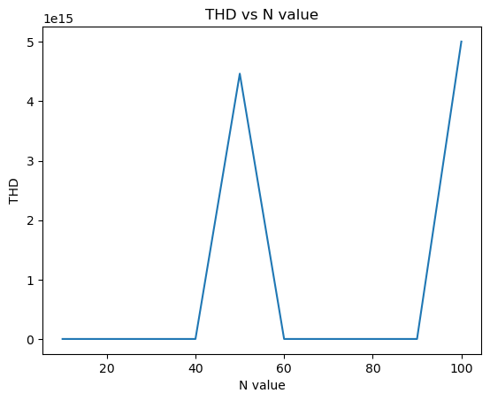

# Frequency dictionary with the DFT (FFT) and filtering

## Subject and Objective

The objective is:

1.  To create a sinusoidal signal and analyze its Fourier Transform.

2.  To cexamine the Fourier Transform of the signal with varying
    frequency values.

3.  To comprehend the frequency spectrum of the Fourier Transform and
    the factors affecting it.

4.  To process an ECG signal by eliminating the 60Hz electrical network
    interference and reducing the noise level.

# Methodology and development

The implementation was done in *Python* and the following libraries were
used:

-   *Numpy*

-   *Scipy*

-   *Matplotlib*

The methodology followed in this report includes the following steps:

## Frequency dictionary with the DFT

1.  Generation of a sinusoidal signal with specific parameters such as
    signal frequency (fs), sampling frequency (fg), and signal length
    (N).
    $$s[k] = sin(2\pi f_s \frac{k}{f_g})$$

2.  Calculation of the Discrete Fourier Transform (DFT) and shifting it
    to the origin. The mathematical formula for DFT is:
    $$X[K] = \sum\_{n = 0}^{N - 1}x[n]e^{-j2\pi k\frac{n}{N}}$$

3.  Generation of another sinusoidal signal with a different frequency
    and computation of its shifted DFT

4.  Comparison and analysis of both the original and new signal by
    analyzing the frequency dictionary which depends on the
    *f*<sub>*g*</sub> and *N*.

5.  For the new signal, finding the optimum and best *N* by using the
    **Total harmonic distortion - THD**. THD is given as:  
       
    $$THD_F = \frac{\sqrt{V_2^2 + V_3^2 + V_4^2 + \dots + V_n^2}}{V_1}$$

## De-noising ECG signal

1.  Load the signal file "100m.mat" and display the signal.

2.  Extract a few periods of the signal and analyze its DFT (amplitude)
    by discarding the mean component.

3.  Cancel the 60Hz electrical network interference from the signal
    using a low pass filter.

4.  Apply a second-order low-pass Butterworth filter (with a damping
    factor of 0.707, which is equal to 50% frequency) in the Fourier
    space to denoise the signal.

5.  Reconstruct the denoised signal.

# Results

In this section, we will look at the results.

## Generating a sin wave and DFT

For the sine wave, we take the following parameters:

``` python
fs = 10, fg = 100, N = 10
```

The output is:

<figure id="fig:Sine_wave">
<figure>

<figcaption>Sine Wave</figcaption>
</figure>
<figure>

<figcaption>FFT</figcaption>
</figure>
<figcaption>Sine Wave and its Fourier Transform</figcaption>
</figure>

## Changed Frequency its and DFT

By changing the *F*<sub>*s*</sub> of the sine wave, we can analyze its
DFT and further inspect the effect of *F*<sub>*g*</sub> and *N* which
defines the frequency dictionary.  
For the new sine wave, we take the following parameters:

``` python
fs = 11, fg = 100 ,N = 10
```

The output is:

<figure id="fig:Sine_wave_2">
<figure>

<figcaption>Sine Wave</figcaption>
</figure>
<figure>

<figcaption>FFT</figcaption>
</figure>
<figcaption>New Sine Wave and its Fourier Transform</figcaption>
</figure>

Here, it can be observed that since *F*<sub>*s*</sub> = 11 is not
present in the frequency spectrum, the FFT algorithm attempts to
approximate the output by interpolating the nearest available
frequencies.

## Total harmonic distortion - THD

The result of THD is:

<figure id="fig:THD">

<figcaption>THD vs N</figcaption>
</figure>

This plot shows the plot of THG against a range of N and from this plot
we can find the N which will be the first minimum value. For
*F*<sub>*s*</sub> = 18, with the previously defined frequency library,
the result it gives us is:  

Optimum N = 20

## Filtering ECG signal

First we load the ECG signal from the provided file and then take a part
from it:

<figure id="fig:ECG">
<figure>

<figcaption>ECG Signal</figcaption>
</figure>
<figure>

<figcaption>Part of ECG signal</figcaption>
</figure>
<figcaption>Provided ECG Signal</figcaption>
</figure>

Next, we take the **DFT** of the ECG signal with discarding the mean:

<figure id="fig:DFT_ECG">

<figcaption>DFT of ECG</figcaption>
</figure>

From this, we can see that most of the signal is noise so we have to
remove the noise. To do this, we can pass the ECG signal through filter
which will remove the noise.

## Spurious frequency Filtering

We first want to remove the spurious frequency of the 60Hz electrical
network. To this, we will pass the signal through a band stop filter.
The implementation is:

``` python
    def remove_spurious_frequency(signal, fs=1000):
    # Design the band-stop filter
    nyquist = 0.5 * fs
    low = 59 / nyquist
    high = 61 / nyquist
    b, a = butter(2, [low, high], 'bandstop')

    # Apply the filter to the signal
    filtered_signal = filtfilt(b, a, signal)

    return filtered_signal
```

The result is as following:

<figure id="fig:ECG_">
<figure>

<figcaption>ECG Signal</figcaption>
</figure>
<figure>

<figcaption>Spurious frequency Filtered</figcaption>
</figure>
<figcaption>Provided ECG Signal vs the Spurious frequency
Filtered</figcaption>
</figure>

## De-noising the ECG

Now, we want to remove noise with a damping factor of 0.707 using a
butterworth second order filter.  
The implimenation is as:

``` python
def lowpass_filter(signal, fs = 1000):
    
    cutoff_frequency= damping_to_frequency(0.707, fs)
    # Design the low-pass filter
    nyquist = 0.5 * fs
    cutoff = cutoff_frequency / nyquist
    b, a = butter(2, cutoff, 'low', analog=False)

    # Apply the filter in the frequency domain
    signal_fft = fft.fft(signal)
    frequencies = fft.fftfreq(signal.size, 1/fs)
    filter_response = freqz(b, a, frequencies)
    filtered_signal_fft = signal_fft * filter_response[1]

    # Reconstruct the filtered signal
    filtered_signal = fft.ifft(filtered_signal_fft)
    filtered_signal = np.real(filtered_signal)

    return filtered_signal
```

The result is as following:

<figure id="fig:ECG__">
<figure>

<figcaption>ECG Signal</figcaption>
</figure>
<figure>

<figcaption>De-noised signal</figcaption>
</figure>
<figcaption>Spurious frequency Filtered Signal vs the De-noised
Signal</figcaption>
</figure>

We can see that most of the noise has been removed from the signal.

# Conclusion

In this challenge, we saw how changing the frequency (*F*<sub>*s*</sub>
of a signal will change the DFT and how the DFT depends on the frequency
dictionary which depends on *F*<sub>*g*</sub> and *N*.  
We also looked at an ECG signal and how to remove one specific frequency
element and also remove noise using a low pass butterworth filter.  
However, we can further denoise a signal by designing a better low pass
filter.  
The code can be seen in the appendix.

# Appendix

## Libraries

``` python
    import numpy as np
    import scipy.io as sio
    import matplotlib.pyplot as plt
    from scipy.signal import butter, lfilter, filtfilt, freqz
    import scipy.fftpack as fft
```

## Sine wave Generated

``` python
def generate_sin_wave(fs, fg, N):
    Np = int(fg/fs)
    k = np.arange(N)
    s = np.sin(2 * np.pi * fs * k / fg)
    plt.stem(k, s)
    plt.xlabel('Frequency (Hz)')
    plt.ylabel('Amplitude')
    plt.title('Discrete-domain Sin Wave')
    plt.show()
    return s, Np
```

## Shifted DFT

``` python
def compute_dft(s):
    N = len(s)
    S = np.abs(np.fft.fftshift(np.fft.fft(s)))
    f = np.linspace(-N//2, N//2-1, N) * 10
    plt.stem(f, S)
    plt.xlabel('Frequency (Hz)')
    plt.ylabel('Amplitude')
    plt.title('Shifted DFT')
    plt.show()
    return S
```

## THD

``` python
def THD(fs, fg, N_range):
    THD = []
    for N in N_range:
        Np = int(fg/fs)
        k = np.arange(N)
        s = np.sin(2 * np.pi * fs * k / fg)
        X_amp = compute_dft(s)
        THD.append(np.sqrt(np.sum(X_amp[1:]**2))/np.max(X_amp[0]))
    min_idx = np.argmin(THD)
    optimal_N = N_range[min_idx]
    plt.plot(N_range, THD)
    plt.xlabel('N value')
    plt.ylabel('THD')
    plt.title('THD vs N value')
    plt.show()
    return optimal_N
```

## Loading the EEG signal

``` python
# Load the file 100m.mat and display the signal
data = sio.loadmat('100m.mat')
val = data['val']
val = val[0]
```

## Remove Spurious Frequency from ECG

``` python
def remove_spurious_frequency(signal, fs=1000):
    # Design the band-stop filter
    nyquist = 0.5 * fs
    low = 59 / nyquist
    high = 61 / nyquist
    b, a = butter(2, [low, high], 'bandstop')

    # Apply the filter to the signal
    filtered_signal = filtfilt(b, a, signal)

    return filtered_signal
```

## Low pass butterworth Filter for denoising

``` python
def lowpass_filter(signal, fs = 1000):
    
    cutoff_frequency= damping_to_frequency(0.707, fs)
    # Design the low-pass filter
    nyquist = 0.5 * fs
    cutoff = cutoff_frequency / nyquist
    b, a = butter(2, cutoff, 'low', analog=False)

    # Apply the filter in the frequency domain
    signal_fft = fft.fft(signal)
    frequencies = fft.fftfreq(signal.size, 1/fs)
    filter_response = freqz(b, a, frequencies)
    filtered_signal_fft = signal_fft * filter_response[1]

    # Reconstruct the filtered signal
    filtered_signal = fft.ifft(filtered_signal_fft)
    filtered_signal = np.real(filtered_signal)

    return filtered_signal

def damping_to_frequency(damping_factor, sample_rate):
    # Calculate the natural frequency
    natural_frequency = sample_rate / (2 * np.pi) * np.arctan(damping_factor)

    # Calculate the cutoff frequency
    cutoff_frequency = natural_frequency / np.sqrt(1 + damping_factor**2)

    return cutoff_frequency
```
