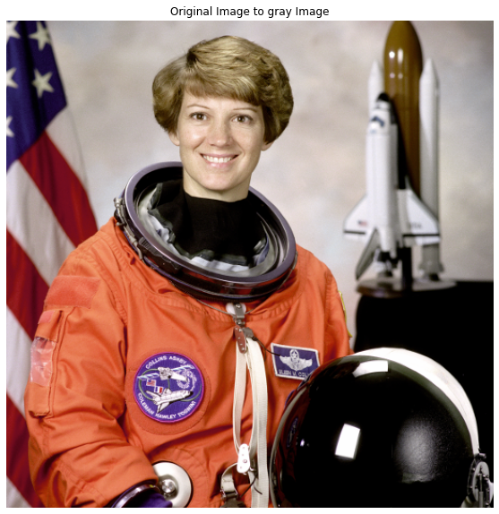
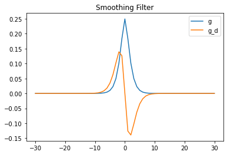
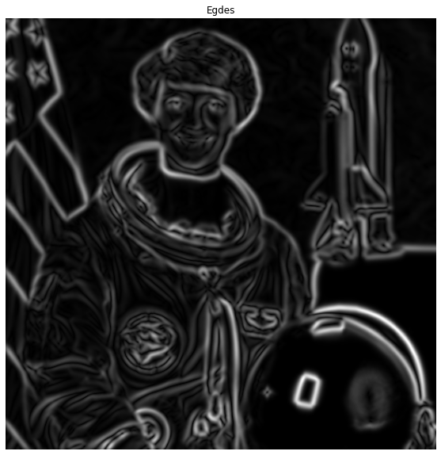
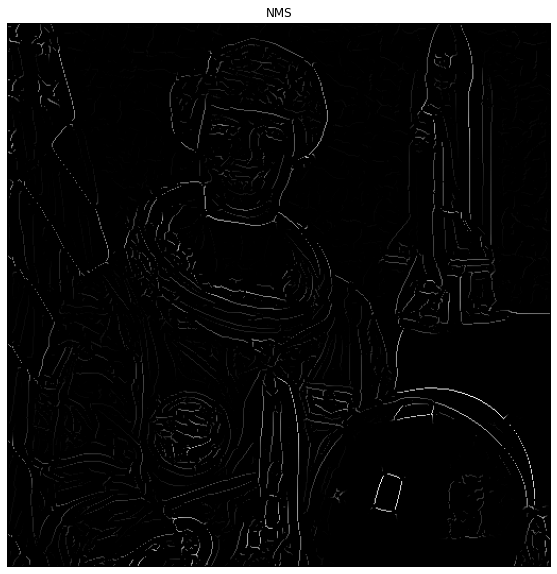
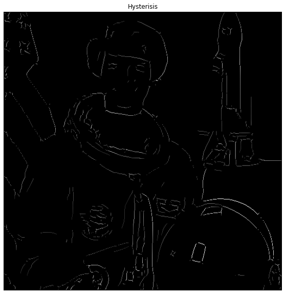

# Canny-Deriche edge detection

Canny edge detection is a computer vision algorithm for edge detection
in images. It was developed by John F. Canny in 1986. It works by
finding areas of the image with rapid intensity changes and marks these
areas as edges. It uses multi-stage algorithm including noise reduction,
gradient calculation, non-maximum suppression, and hysteresis
thresholding.  
Canny-Deriche edge detection is a modification of Canny edge detection
that uses recursive filtering instead of gradient calculation. This
modification results in faster processing time and reduced memory usage,
making it suitable for real-time applications. However, it may not
produce results as accurate as the original Canny edge detection
algorithm.

## Objective

The objective is to:

1.  To apply a custom smoothing filter on an image.

2.  To detect edges in an image by computing gradient magnitude and
    orientation.

3.  To perform non-maximum suppression on the gradient magnitude.

4.  To apply Hysteresis thresholding on the edges to filter weak edges

5.  To plot the smoothing filter and display the processed image with
    edges highlighted.

# Methodology and Development

The implementation of Canny-Deriche filter was done in *Python* and the
following libraries were used:

-   *Numpy*

-   *Scipy*

-   *Matplotlib*

-   *skimage*

The methodology followed in this challenge includes the following steps:

## Image Smoothing

1.  The 1-D smoothing function we are using is defined as:
    *h*<sub>*n*</sub>\[*x*\] = *e*<sup>−*σ*\|*x*\|</sup>(*σ*\|*x*\|+1)
    Where, *σ* is the scaling factor and \|*x*\| is the absolute of the
    length of the filter

2.  Normalize the smoothing filter:
    $$h_n[x] = \frac{h_n[x]}{\sum h_n[x]}$$

3.  To obtain the smoothed image:

    1.  First perform a convolution of the image with the smoothing
        filter *h*<sub>*n*</sub>\[*x*\] along the horizontal direction.
        *S*<sub>*x*</sub> = *i**m**a**g**e* ⋆ *h*<sub>*n*</sub>\[*x*\]

    2.  The result is then passed as input to the second convolution
        where it is convolved with the transpose of
        *h*<sub>*n*</sub>\[*x*\] along the vertical direction
        Smoothed Image = *S*<sub>*x*, *y*</sub> = *S*<sub>*x*</sub> ⋆ *h*<sub>*n*</sub>\[*x*\]<sup>⊺</sup>

    The result is then passed as input to the second convolution where
    it is convolved with the transpose of *h*<sub>*n*</sub>\[*x*\] along
    the vertical direction. This two-step convolution with
    *h*<sub>*n*</sub>\[*x*\] and its transpose smoothes the image. This
    method acts like a 2-D convolution but is not as computationally
    expensive as actual 2-D convolution.

## Edge Detection

Edges are detected using the gradient magnitude and orientation. To do
this,

1.  Take the first derivative of the smoothing filter i.e.,
    *h*<sub>*n*</sub>\[*x*].
    $$\frac{d}{dx}h_n[x] = h'_n[x]$$

2.  To obtain the edge map, we find the gradient in the *x* direction
    and then in the *y* direction by:

    1.  Convolve the derivative of *h*<sub>*n*</sub>\[*x*\] to find the
        gradient along the *x* axis.
        *G*<sub>*x*</sub> = *S*<sub>*x*, *y*</sub> ⋆ *h*′<sub>*n*</sub>\[*x*\]

    2.  Convolve the transpose of derivative of *h*<sub>*n*</sub>\[*x*\]
        to find the gradient along the *y* axis.
        *G*<sub>*y*</sub> = *S*<sub>*x*, *y*</sub> ⋆ *h*′<sub>*n*</sub>\[*x*\]<sup>⊺</sup>

3.  Then computes the magnitude of the gradient by taking the square
    root of the sum of squares of gradient_x and gradient_y.
    $$G\_{x,y} = \sqrt{G_x^2 + G_y^2}$$
    The magnitude of the gradient is a measure of how much the intensity
    of the image changes in different directions.

4.  Last, we find the orientation of the gradient.
    $$\theta\_{G\_{x,y}} = \tan\left(\frac{G_y}{G_x}\right)$$

## Non Max Suppression 

Non-Max Suppression is a technique used in edge detection algorithms to
eliminate pixels that are not local maxima in the gradient magnitude
image, resulting in thinned and well defined edges. The steps are:

1.  Take the gradient magnitude *G*<sub>*x*, *y*</sub> and the gradient
    orientation *θ*<sub>*G*<sub>*x*, *y*</sub></sub> from the previous
    step.

2.  Discretize the gradient direction into one of four main directions
    $(0\degree, 45\degree, 90\degree, 135\degree)$

3.  For each pixel (P) in the edge map, compare the gradient magnitude
    with the gradient magnitudes of the pixels along the direction
    perpendicular(P1 & P2) to the edge direction.  
    *G*(*P*) \< *G*(*P*1)*o**r**G*(*P*) \< *G*(*P*2), *P* = 0

4.  If the gradient magnitude at a pixel is not the maximum in the
    direction perpendicular to the edge, set the value of that pixel to
    zero (i.e. suppress it)

5.  Repeat the process for all pixels in the edge map.

6.  The remaining pixels are considered edge pixels and are kept as the
    result of Non-Max Suppression

## Hysteresis Thresholding

Hysteresis thresholding is a technique in image processing that involves
thresholding an image using two separate threshold values to preserve
the strong edges while suppressing the weak edges and noise. The steps
are:

1.  Take the edge maps from the previous step i.e., NMS. and gradient
    magnitude *G*<sub>*x*, *y*</sub>

2.  Define two threshold values: high threshold
    (*T*<sub>*h*</sub>*i**g**h*) and low threshold
    (*T*<sub>*l*</sub>*o**w*).

3.  Initialize all pixels with gradient magnitude *G*<sub>*x*, *y*</sub>
    above *T*<sub>*h*</sub>*i**g**h* as strong edge pixels.

4.  Initialize all pixels with gradient magnitude below
    *T*<sub>*l*</sub>*o**w* as non-edge pixels.

5.  For pixels with gradient magnitude between *T*<sub>*l*</sub>*o**w*
    and *T*<sub>*h*</sub>*i**g**h*, check if they are connected to a
    strong edge pixel (horizontally, vertically and diagonally. If so,
    mark them as edge pixels.

6.  Finally, edge pixels that have been marked are used to produce the
    final edge map.

# Results

First we take an image and convert it to gray-scale:

<figure id="fig:Orignal image">
<figure>

</figure>
<figure>

</figure>
<figcaption>Original Image and Gray Scale Image</figcaption>
</figure>

## Image Smoothing

With *σ* = 1 for equation
(<a href="#1" data-reference-type="ref" data-reference="1">[1]</a>)
*h*<sub>*n*</sub>\[*x*\] and it’s derivative *h*<sub>*n*</sub>\[*x*\]
is:

<figure id="fig:smoothing_filter_and_derivative">

<figcaption>Smoothing filter (in Blue) and its Derivative (in
orange)</figcaption>
</figure>

After smoothing the image, the result is:

<figure id="fig:Smoothed image">
<figure>

<figcaption>Gray Scale Image</figcaption>
</figure>
<figure>

<figcaption>Smoothed Image</figcaption>
</figure>
<figcaption>Gray Scale Image vs Smoothed Image</figcaption>
</figure>

Here we can see that our gray-scale image has been smoothed. We can
change the level of smoothness by changing the value of *σ*

## Edge Detection

Here we pass the smoothed image and find the edges using the derivative
of *h*<sub>*n*</sub>\[*x*\]. The results are:

<figure id="fig:Edge Map">
<figure>

<figcaption>Smoothed Image</figcaption>
</figure>
<figure>

<figcaption>Edge Map</figcaption>
</figure>
<figcaption>Smoothed Image vs Edge Map</figcaption>
</figure>

Here we can see that an initial edge map is formed using the gradient
magnitude *G*<sub>*x*, *y*</sub> but the edges are thick and not
thresholded.

## Non Max Suppression

We can eliminate pixels that are not local maxima in the gradient
magnitude edge map, resulting in thinned and well defined edges. The
results are:

<figure id="fig:NMS Edge Map">
<figure>

<figcaption>Initial Edge Map</figcaption>
</figure>
<figure>

<figcaption>Edge Map after NMS</figcaption>
</figure>
<figcaption>Edge Map vs Edge Map after NMS</figcaption>
</figure>

## Hysteresis Thresholding

We can fine tune the Edges in the edge map generated by the NMS proccess
by using hysteresis thresholding that involves thresholding an image
using two separate threshold values to preserve the strong edges while
suppressing the weak edges and noise.By using
*T*<sub>*L**o**w*</sub> = 0.05 and *T*<sub>*H**i**g**h*</sub> = 0.15,
the results are:

<figure id="fig:NMS Edge Map">
<figure>

<figcaption>Edge Map after NMS</figcaption>
</figure>
<figure>

<figcaption>Edge Map after Hysteresis Thresholding</figcaption>
</figure>
<figcaption>NMS Edge Map vs Edge Map after Hysteresis
Thresholding</figcaption>
</figure>

Now we can see that the edges are well defined and weak edges have been
discarded.

# Conclusion

In this challenge we implemented the Canny-Deriche algorithm. The
algorithm starts by converting the input image to gray-scale, then
applying a smoothing filter to the grayscale image to remove noise and
smooth the image. After that, gradient magnitude and orientation are
calculated using the derivative of the smoothing filter. Then, non-max
suppression is applied to get rid of pixels that are not part of an
edge. Finally, hysteresis thresholding is applied to preserve strong
edges and remove weak edges that may have been preserved during non-max
suppression.  
The Canny-Deriche results in faster processing time and reduced memory
usage, making it suitable for real-time applications. However, we can
further fine tune the algorithm by changing the smoothing filter and
defining a better thresholding technique.  
The code can be seen in the appendex.

# Appendix

## Libraries

``` python

import numpy as np
import matplotlib.pyplot as plt
from skimage import data
from skimage.color import rgb2gray
from scipy import signal
import cv2
from scipy.ndimage import convolve
```

## Image Smoothing

``` python

def smooth_image(image, sigma=1):
    # Compute smoothing filter
    r = int(np.ceil(30))
    x = np.arange(-r, r+1, dtype=float)
    g = np.exp(-sigma * np.abs(x)) * (sigma * np.abs(x) + 1)
    g = g / np.sum(g)
    g_d = -x * g
    g_d = g_d / np.sum(np.abs(g_d))

    # Plot smoothing filter
    plt.figure()
    plt.plot(x, g, label='g')
    plt.plot(x, g_d, label='g_d')
    plt.legend()
    plt.title('Smoothing Filter')

    # Apply smoothing filter to image
    g = g.reshape((1, -1))
    g_d = g_d.reshape((1, -1))
    smoothed = convolve(image, g)
    smoothed = convolve(smoothed, g.T)

    return x, g, g_d, smoothed
```

## Edge Detection

``` python

def edge_detection(g_d, smoothed):
    # Compute gradient magnitude and orientation
    gradient_x = convolve(smoothed, g_d)
    gradient_y = convolve(smoothed, g_d.T)
    gradient_magnitude = np.sqrt(gradient_x**2 + gradient_y**2)
    gradient_orientation = np.arctan2(gradient_y, gradient_x)

    return gradient_magnitude, gradient_orientation
```

## Non Max Suppression

``` python

def non_max_suppression(gradient_magnitude, gradient_orientation):
    edges = np.zeros_like(gradient_magnitude)
    for i in range(1, gradient_magnitude.shape[0]-1):
        for j in range(1, gradient_magnitude.shape[1]-1):
            orientation = gradient_orientation[i, j]
            if orientation < 0:
                orientation += np.pi
            orientation = int(orientation / (np.pi / 4))
            if (orientation == 0 and 
            gradient_magnitude[i, j] > gradient_magnitude[i, j-1] 
            and gradient_magnitude[i, j] > gradient_magnitude[i, j+1]) or 
            (orientation == 1 and
            gradient_magnitude[i, j] > gradient_magnitude[i-1, j+1] and
            gradient_magnitude[i, j] > gradient_magnitude[i+1, j-1]) or 
            (orientation == 2 and
            gradient_magnitude[i, j] > gradient_magnitude[i-1, j] and
            gradient_magnitude[i, j] > gradient_magnitude[i+1, j]) or 
            (orientation == 3 and
            gradient_magnitude[i, j] > gradient_magnitude[i-1, j-1] and 
            gradient_magnitude[i, j] > gradient_magnitude[i+1, j+1]) or 
            (orientation == 4 and
            gradient_magnitude[i, j] > gradient_magnitude[i, j-1] and 
            gradient_magnitude[i, j] > gradient_magnitude[i, j+1]):
                edges[i, j] = gradient_magnitude[i, j]

    return edges
```

## Hysterisis Thresholding

``` python

def hysterisis_thresholding(edges, gradient_magnitude, low_threshold, high_threshold):
    low_edges = edges * (edges >= low_threshold)
    high_edges = edges * (edges >= high_threshold)
    for i in range(1, gradient_magnitude.shape[0]-1):
        for j in range(1, gradient_magnitude.shape[1]-1):
            if high_edges[i, j] != 0:
                d = [(1, 0), (1, 1), (0, 1), (-1, 1),
                     (-1, 0), (-1, -1), (0, -1), (1, -1)]
                for di, dj in d:
                    ii, jj = i + di, j + dj
                    if ii >= 0 and
                    ii < gradient_magnitude.shape[0] and jj >= 0
                    and jj < gradient_magnitude.shape[1]:
                        if low_edges[ii, jj] != 0:
                            high_edges[ii, jj] = gradient_magnitude[ii, jj]

    return high_edges
```

## Main Body

``` python

#     """
#     Perform Canny-Deriche edge detection on the input image.

#     Parameters:
#     - image (2D numpy array): Input image.
#     - alpha (float): Decay rate for radial basis function.
#     - sigma (float): Standard deviation for Gaussian smoothing.
#     - low_threshold (float): Lower threshold for edge intensity.
#     - high_threshold (float): Higher threshold for edge intensity.

#     Returns:
#     - edges (2D numpy array): Edge map, with values ranging from 0 to 1.

img = data.astronaut()
img = rgb2gray(img)

x, g, g_d, smoothed = smooth_image(img, sigma=1)

gradient_magnitude, gradient_orientation = edge_detection(g_d, smoothed)

edges = non_max_suppression(gradient_magnitude, gradient_orientation)

high_edges = hysterisis_thresholding(edges, gradient_magnitude,
                                     low_threshold=0.05, high_threshold=0.1)

# Plot smoothed image
plt.figure(figsize=(10, 10))
plt.axis('off')
plt.imshow(smoothed, cmap='gray')
plt.title('Smoothed Image')


# plot edges
plt.figure(figsize=(10, 10))
plt.axis('off')
plt.imshow(gradient_magnitude, cmap='gray')
plt.title('Egdes')

# plot result of Non-max-supression
plt.figure(figsize=(10, 10))
plt.axis('off')
plt.imshow(edges, cmap='gray')
plt.title('NMS')

# plot final edges after Hysterisis thresholding
plt.figure(figsize=(10, 10))
plt.axis('off')
plt.imshow(high_edges, cmap='gray')
plt.title('Hysterisis')
```
