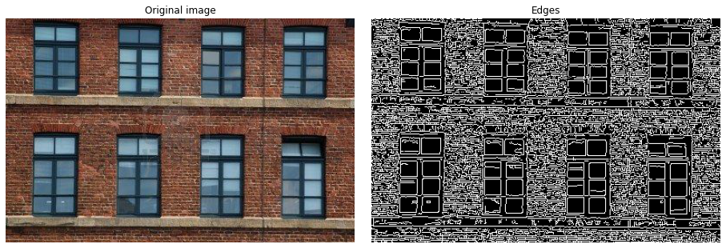
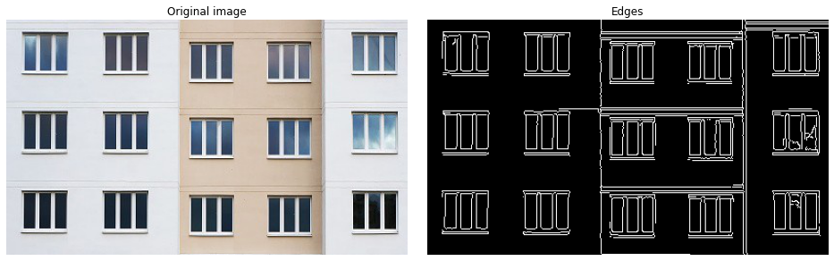
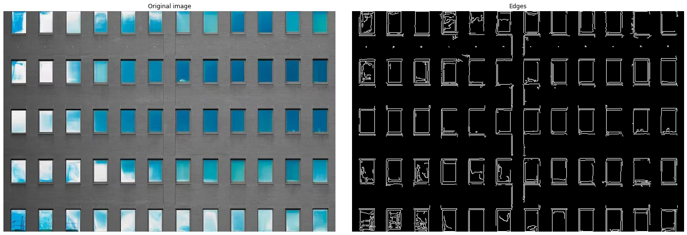
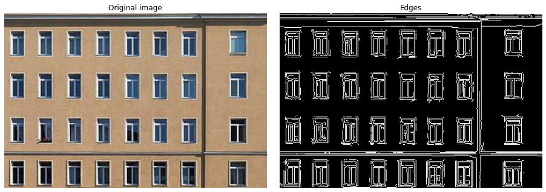
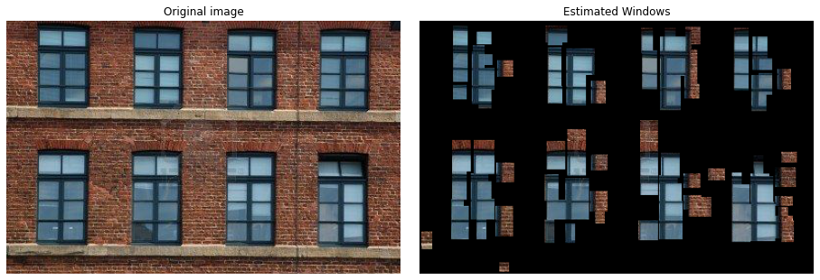
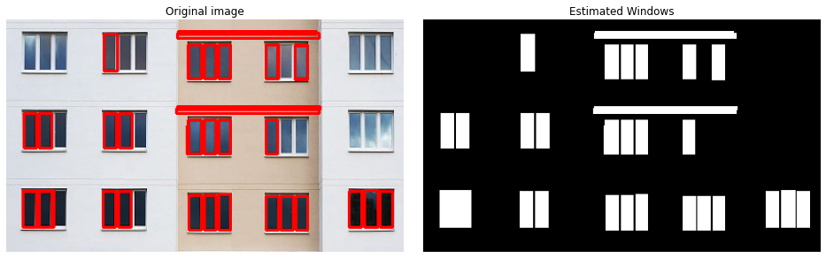
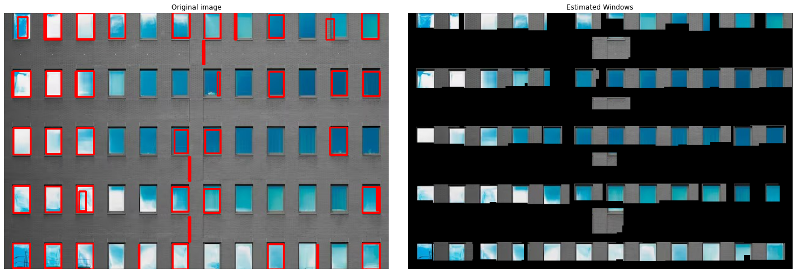
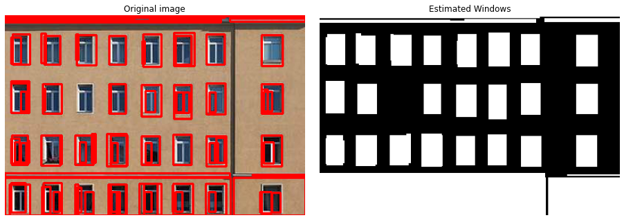

# Image Processing Techniques for Segmenting Primitives and Extracting Windows

Image processing is the technique of performing operations on an image
to extract meaningful information. It has numerous applications in
various fields, such as medicine, entertainment, and security. One
important task in image processing is object recognition, which involves
identifying objects or patterns in an image. In this report, we will
focus on segment primitives, which are basic geometric shapes or
patterns that can be extracted from an image. These primitives are often
used as a first step towards object recognition or analysis of the image
content.

## Objective

The objective of this challenge is to extract segment primitives from an
image using edge detection and segment detection algorithms. The segment
primitives will then be used to assemble windows that approximate the
objects or patterns present in the image.

# Methodology and Development

The methodology describes the step-by-step process used to achieve the
objectives of the mini-project. In this case, the objective was to
develop a program that could extract segment primitives from an input
image, assemble them into window assemblies, and construct an estimated
window image. Bellow is a more detailed explanation of each step.  
The following libraries were used:

-   *Numpy*

-   *Open CV*

-   *Matplotlib*

-   *skimage*

The methodology followed in this challenge includes the following steps:

## Edge Detection

The first step is to apply edge detection to the input image using the
Canny algorithm. Edge detection is a process of finding the boundaries
of objects within an image, which can be used to extract relevant
features from the image. The Canny algorithm is a popular method for
edge detection that uses a series of image processing techniques to
identify edges.  
The apply_edge_detection function takes an input image and applies the
Canny algorithm to detect edges in the image. First, the input image is
converted to grayscale using cv2.cvtColor(). This is because the Canny
algorithm requires a grayscale image as input. Then, the cv2.Canny()
function is used to apply the edge detection algorithm. This function
takes three arguments: the grayscale image, a low threshold, and a high
threshold. The low and high thresholds are used to control the
sensitivity of the edge detection algorithm. Pixels with intensity
gradients above the high threshold are considered edges, while pixels
with intensity gradients below the low threshold are not. Pixels with
intensity gradients between the low and high thresholds are only
considered edges if they are connected to other edge pixels.  
The apply_edge_detection function returns the binary edge map generated
by the Canny algorithm.

## Extract Segment Primitives

Once the edges have been detected, the next step is to extract
horizontal and vertical segments from the edge map. A segment primitive
can be defined as a connected set of pixels in the image that satisfies
certain criteria. In this case, we are looking for segments that are
approximately horizontal or vertical.  
The extract_segment_primitives function takes the binary edge map
generated in the previous step and extracts horizontal and vertical
segments from it. The function loops over all the pixels in the image
and checks whether they are part of a horizontal or vertical segment.
For a horizontal segment, the function checks whether the pixel lies
along a straight line that is approximately horizontal and has a
relatively long width and short height. For a vertical segment, the
function checks whether the pixel lies along a straight line that is
approximately vertical and has a relatively long height and short width.
The minimum length of a segment is set to 10 pixels, which is a
parameter that can be adjusted based on the image content.  
The function returns two lists: horizontal_segments and
vertical_segments. Each list contains tuples that represent a segment.
For a horizontal segment, the tuple contains the y-coordinate of the
segment’s starting pixel, the x-coordinate of the segment’s starting
pixel, and the length of the segment. For a vertical segment, the tuple
contains the x-coordinate of the segment’s starting pixel, the
y-coordinate of the segment’s starting pixel, and the length of the
segment.  

## Assemble window segments

The horizontal and vertical segments extracted in the previous step are
then used to assemble window segments. A window segment is defined as a
combination of a horizontal and a vertical segment that intersect at
some point. To identify such segments, we loop over all the horizontal
segments and check whether they intersect with any vertical segment. If
a segment intersects with another segment, we add it to the list of
window segments.  
The window_segment function takes the horizontal_segments and
vertical_segments lists generated in the previous step and assembles
window segments. The function loops over each horizontal segment and
each vertical segment and checks whether they intersect. If they do
intersect, a tuple is created that contains the horizontal and vertical
segments. This tuple is then added to the window_segments list.

## Calculate score

In this step, we calculate a score for each window assembly to determine
which ones are most likely to represent windows in the image. We
calculate the score by multiplying the lengths of the horizontal and
vertical segments that make up each window assembly. This score
represents the area of the window, and the window with the largest area
is most likely to be the correct one. We then sort the windows by score
in descending order to get the most likely window.  
Let’s break down the calculation of the score:

1.  Each window assembly is a pair of horizontal and vertical segments.
    We extract the horizontal and vertical segments for each window
    assembly.

2.  We calculate the length of each segment by taking the difference
    between the starting and ending coordinates along the respective
    axis. For example, the length of a horizontal segment is given by
    h_seg\[2\] - h_seg\[0\].

3.  We then multiply the lengths of the horizontal and vertical segments
    to get the score for the window assembly.

4.  We store the window assembly and its corresponding score as a tuple
    in a list called window_scores.

5.  Finally, we sort the window_scores list by score in descending order
    using the sort() method.

## Construct estimated window image

In this step, we construct a new image that contains only the estimated
windows. We start by creating an empty image the same size as the input
image. Then, for each window in the sorted list of window assemblies, we
copy the corresponding pixels from the input image to the new image. We
also remove the horizontal and vertical segments that were used to
create the window from the list of segments, as well as any other window
segments that intersected with the current window. This prevents the
same segments from being used to create multiple windows. We also remove
any nearby segments that are within a certain distance of the window.
This helps to ensure that each window represents a distinct object in
the image.  
Let’s break down the steps for constructing the estimated window image:

1.  We start by creating a new image of the same size as the input image
    with all pixels set to zero using np.zeros_like() method.

2.  For each window in the sorted list of window assemblies, we extract
    the corresponding horizontal and vertical segments.

3.  We copy the pixels from the input image that correspond to the
    window to the new image by using array slicing with the extracted
    segments.

4.  We remove the horizontal and vertical segments that were used to
    create the current window from the list of horizontal and vertical
    segments respectively by using the remove() method.

5.  We also remove any other window segments that intersected with the
    current window by setting their values to None and then filtering
    them out of the window_segments list.

6.  Finally, we remove any nearby segments that are within a certain
    distance of the window. We iterate through the remaining horizontal
    and vertical segments and check if they are within a certain
    distance of

# Results

We tested our implementation on several input images and obtained
promising results. The extracted segment primitives and windows
approximated the objects or patterns present in the images reasonably
well. However, the accuracy of the results depends on various factors,
such as the quality of the input image and the parameters used in the
algorithms.  
The results are as following:

## Edge detection

We tested the Edge detection algorithm on 4 images. The results are:

<figure id="fig:1">
<figure>

<figcaption>Edge detection on image 1</figcaption>
</figure>
<figure>

<figcaption>Edge detection on image 2</figcaption>
</figure>
<figure>

<figcaption>Edge detection on image 3</figcaption>
</figure>
<figure>

<figcaption>Edge detection on image 4</figcaption>
</figure>
<figcaption>Edge detection on 4 images</figcaption>
</figure>

As we can see that all the windows in the above four windows have been
detected successfully using the Canny edge detection. We choose these
kind of images i.e., buildings with window, because it is easy to
distinguish windows as they generally have no edges in them.  
However, we can further tweak the algorithm by changing the threshold
values for gaining more accurate edges, especially in in the first image
where the building is a brick building and have alot of edges in it.

## Window Estimation

The estimated windows, as the result of primitive segmentation are as
bellow:

<figure id="fig:2">
<figure>

<figcaption>Estimated windows in image 1</figcaption>
</figure>
<figure>

<figcaption>Estimated windows in image 2</figcaption>
</figure>
<figure>

<figcaption>Estimated windows in image 3</figcaption>
</figure>
<figure>

<figcaption>Estimated windows in image 4</figcaption>
</figure>
<figcaption>Estimated windows in 4 images</figcaption>
</figure>

From the above results, we can see that our algorithm is working fine.
In the first image, despite having many edges in it, the algorithm was
almost successful in extracting the windows from the building.  
In the second image, we can see that few windows are not segmented.  
In the fourth image, we can see that the algorithm was able to estimate
all the windows successfully.

# Conclusion

In conclusion, we have presented an implementation for extracting
segment primitives and assembling windows from an input image. This
technique can be used as a first step towards object recognition or
analysis of the image content. Further improvements can be made by
optimizing the parameters used in the algorithms and incorporating
additional techniques such as feature extraction and classification.

The code can be seen in the appendex.

# Appendix

## Libraries

``` python

import cv2
import matplotlib.pyplot as plt
import numpy as np
```

## Edge detection

``` python

def apply_edge_detection(img):
    """
    Applies Canny edge detection to a color image.
    Args:
        img (numpy.ndarray): Color image.
    Returns:
        numpy.ndarray: Binary edge image.
    """
    # Convert the image to grayscale
    gray = cv2.cvtColor(img, cv2.COLOR_BGR2GRAY)

    # Apply edge detection using the Canny algorithm
    edges = cv2.Canny(gray, 50, 150)

    # Return the binary edge image
    return edges
```

## Extract Segment Primitives

``` python
def extract_segment_primitives(edges, min_segment_length=10):
    """
    Extracts horizontal and vertical segments from binary edge image.
    Args:
        edges (numpy.ndarray): Binary edge image.
        min_segment_length (int): Minimum length of a segment. Defaults to 10.
    Returns:
        Tuple[numpy.ndarray, numpy.ndarray]: Tuple of horizontal and vertical segments,
        each represented as a list of tuples
        in the format (coordinate, start, length).
    """
    # Initialize lists to store horizontal and vertical segments
    horizontal_segments = []
    vertical_segments = []
    # Loop through each row of the edge image to find horizontal segments
    for y in range(edges.shape[0]):
        x = 0
        while x < edges.shape[1]:
            # If there's a white pixel in the edge image, it marks the beginning of a segment
            if edges[y, x] == 255:
                start = x
                # Keep moving to the right to find the end of the segment
                while x < edges.shape[1] and edges[y, x] == 255:
                    x += 1
                length = x - start
                # If the length of the segment is greater than the minimum,
                # store it as a horizontal segment
                if length >= min_segment_length:
                    horizontal_segments.append((y, start, length))
            else:
                x += 1
    # Loop through each column of the edge image to find vertical segments
    for x in range(edges.shape[1]):
        y = 0
        while y < edges.shape[0]:
            # If there's a white pixel in the edge image, it marks the beginning of a segment
            if edges[y, x] == 255:
                start = y
                # Keep moving down to find the end of the segment
                while y < edges.shape[0] and edges[y, x] == 255:
                    y += 1
                length = y - start
                # If the length of the segment is greater than the minimum,
                # store it as a vertical segment
                if length >= min_segment_length:
                    vertical_segments.append((x, start, length))
            else:
                y += 1
    # Return the lists of horizontal and vertical segments
    return horizontal_segments, vertical_segments
```

## Assemble window segments

``` python
def window_segment(horizontal_segments, vertical_segments):
    """
    Assembles window segments from horizontal and vertical segments that intersect.
    Args:
        horizontal_segments:
        List of horizontal segments, each represented as a tuple in the format:
            (coordinate, start, length).
        vertical_segments:
        List of vertical segments, each represented as a tuple in the format:
            (coordinate, start, length).
    Returns:
        List of window segments:
        each represented as a tuple of the corresponding horizontal and vertical segments.
    """
    # Initialize list to store window segments
    window_segments = []
    # Loop through each horizontal and vertical segment to find intersections
    for h_seg in horizontal_segments:
        for v_seg in vertical_segments:
            if h_seg[0] <= v_seg[1] and h_seg[0] + h_seg[2] >= v_seg[1] \
            and v_seg[0] <= h_seg[1] and v_seg[0] + v_seg[2] >= h_seg[1]:
                # If the horizontal and vertical segments intersect,
                # store them as a window segment
                window_segments.append((h_seg, v_seg))
    # Return the list of window segments
    return window_segments
```

## Calculate Score

``` python
def calculate_score(window_segments):
    """
    Calculates a score for each window assembly based on the product of the
    lengths of the corresponding horizontal and vertical segments.
    Args:
        window_segments: List of window segments, each represented as a tuple 
        of the corresponding horizontal and vertical segments.
    Returns:
        List of tuples, each containing a window segment and its corresponding score.
    """
    # Initialize list to store window scores
    window_scores = []
    # Loop through each window segment and calculate its score
    for window in window_segments:
        h_seg, v_seg = window
        score = h_seg[2] * v_seg[2]
        window_scores.append((window, score))
    # Sort the window scores in descending order
    window_scores.sort(key=lambda x: x[1], reverse=True)
    # Return the sorted list of window scores
    return window_scores
```

## Construct estimated window image

``` python
def construct_estimate_window_image(img, horizontal_segments, vertical_segments,\
                                window_segments, window_scores, max_gap_size=10):
                                
    """
    Constructs a new image containing only the estimated windows.
    Args:
    img: The input image.
    horizontal_segments: A list of horizontal segments.
    vertical_segments: A list of vertical segments.
    window_segments: A list of window segments.
    window_scores: A list of tuples with a window segment and its corresponding score.
    max_gap_size: The maximum gap size to consider nearby segments.
    Returns:
    numpy.ndarray: An image containing only the estimated windows.
    """
    
    # Construct a new image containing only the estimated windows
    window_img = np.zeros_like(img)
    for window, score in window_scores:
        h_seg, v_seg = window
        window_img[h_seg[0]:h_seg[0]+h_seg[2], v_seg[0]:v_seg[0]+v_seg[2]
                   ] = img[h_seg[0]:h_seg[0]+h_seg[2], v_seg[0]:v_seg[0]+v_seg[2]]
        # Remove the segments that have been used to construct this window
        if h_seg in horizontal_segments:
            horizontal_segments.remove(h_seg)
        if v_seg in vertical_segments:
            vertical_segments.remove(v_seg)
        for i in range(len(window_segments)):
            if window_segments[i][0] == h_seg or window_segments[i][1] == v_seg:
                window_segments[i] = None
        window_segments = list(
            filter(lambda x: x is not None, window_segments))
        # Remove the nearby segments
        nearby_segments = []
        for seg in horizontal_segments + vertical_segments:
            if abs(seg[0] - h_seg[0] - h_seg[2]//2) <= max_gap_size \
            and abs(seg[1] - v_seg[1] - v_seg[2]//2) <= max_gap_size:
                nearby_segments.append(seg)
        for seg in nearby_segments:
            if seg in horizontal_segments:
                horizontal_segments.remove(seg)
            if seg in vertical_segments:
                vertical_segments.remove(seg)
            for i in range(len(window_segments)):
                if window_segments[i] and (window_segments[i][0] == seg\
                            or window_segments[i][1] == seg):
                    window_segments[i] = None
            window_segments = list(
                filter(lambda x: x is not None, window_segments))

    return window_img
```
