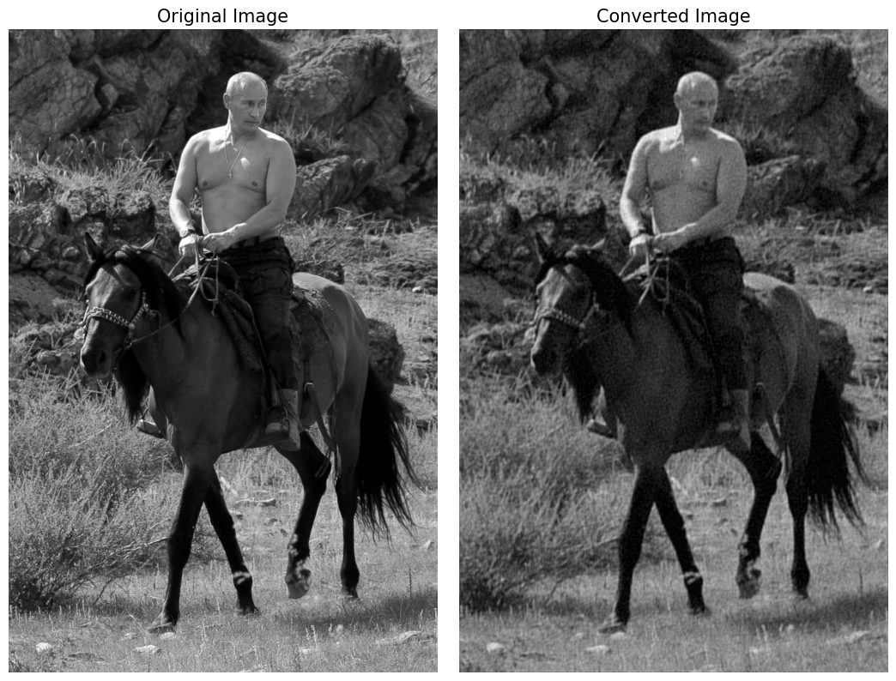
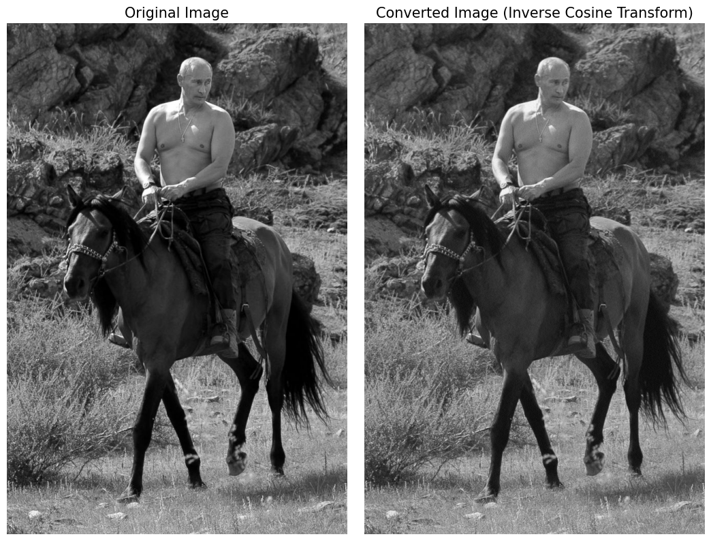
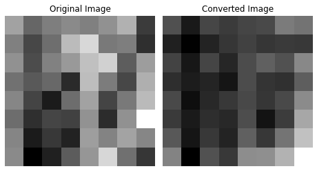

# Comparison of Fourier and Cosine Transform for Image Compression

Image compression is an essential step for image processing as it
enables efficient storage and transmission of images. In this report, we
compare the Fourier Transform and Cosine Transform for image
compression. Both transforms can be used to compress an image by
discarding coefficients below a certain threshold. We will compare the
two transforms based on their compression performance and the quality of
the reconstructed images.

## Objectives

The objectives of this challenge is:

1.  To implement Fourier Transform and Cosine Transform for image
    compression.

2.  To compare the compression performance and the quality of the
    reconstructed images of Fourier Transform and Cosine Transform.

## Fourier Transform

The Fourier Transform is a mathematical tool that can be used to analyze
signals, including images. In the context of image processing, the
Fourier Transform can be used to represent an image as a sum of
sinusoidal functions of varying frequencies, amplitudes, and phases.
This representation can be useful for various image processing tasks,
such as image compression, filtering, and feature extraction.  
The discrete Fourier Transform is given as:

$$
    F(u,v)=\frac{1}{MN}\sum\_{x=0}^{M-1}\sum\_{y=0}^{N-1}f(x,y)\exp\left(-j2\pi\left(\frac{ux}{M}+\frac{vy}{N}\right)\right)$$

Where *F*(*u*,*v*) is the complex-valued Fourier transform of the 2D
discrete signal *f*(*x*,*y*) of size *M* × *N* pixels, and *j* is the
imaginary unit. The Fourier transform gives information about the
frequency components of the image. The inverse Fourier transform can be
used to reconstruct the original image from its frequency components.
The Fast Fourier Transform (FFT) algorithm is commonly used to compute
the Fourier transform efficiently.

## Discrete Cosine Transform (DCT)

Discrete Cosine Transform (DCT) is a commonly used technique for image
compression, similar to Fourier Transform. DCT is a lossy compression
technique that converts image data from the spatial domain to the
frequency domain, in which the most important information is stored in
the lower frequency components. Unlike Fourier Transform, DCT uses only
real numbers and cosine functions to represent the image data, which
simplifies the calculations required for compression. DCT is widely used
in image and video compression standards such as JPEG, MPEG, and
H.264.  
The discrete Cosine Transform is given by:

$$
    F(u,v)=\frac{2}{N}\alpha(u)\alpha(v)\sum\_{x=0}^{M-1}\sum\_{y=0}^{N-1}f(x,y)\cos\Big(\frac{(2x+1)u\pi}{2M}\Big)\cos\Big(\frac{(2y+1)v\pi}{2N}\Big)$$

where *F*(*u*,*v*) is the transformed coefficient at position (*u*,*v*)
in the frequency domain, *f*(*x*,*y*) is the image intensity value at
position (*x*,*y*) in the spatial domain, *N* is the size of the image,
and *α*(*u*) and *α*(*v*) are normalization constants defined as:

$$\alpha(u)=\begin{cases}\frac{1}{\sqrt{N}},&\text{if }u=0 \\ \frac{2}{\sqrt{N}},&\text{otherwise}\end{cases}$$
  
$$\alpha(v)=\begin{cases}\frac{1}{\sqrt{N}}, &\text{if }v=0\\ \frac{2}{\sqrt{M}},&\text{otherwise}\end{cases}$$
  
By applying DCT to an image, its energy can be efficiently represented
in a compact form, which enables the image to be compressed without
significantly affecting its perceived quality. However, since DCT is a
lossy compression technique, some information is lost during the
compression process, resulting in a trade-off between compression ratio
and image quality.

## Peak Signal-to-Noise Ratio (PSNR)

PSNR stands for Peak Signal-to-Noise Ratio, and it is a widely used
metric to evaluate the quality of a reconstructed signal compared to the
original signal. PSNR measures the ratio of the peak signal power to the
noise power in the signal, and it is expressed in decibels (dB).

The PSNR is calculated as follows:

$$
    \text{PSNR} = 10 \cdot \log\_{10} \left(\frac{(2^{MAX_I} - 1)^2}{\text{MSE}}\right)$$

where *M**A**X*<sub>*I*</sub> is the maximum possible pixel value of the
image (usually 255 for an 8-bit image), and MSE is the Mean Squared
Error between the original and reconstructed images. The lower the MSE,
the higher the PSNR value, which indicates better reconstruction
quality.

PSNR is commonly used in image and video compression, where it is used
to measure the quality of the compressed data relative to the original
data. In practice, a higher PSNR value indicates a better quality of the
reconstructed image. However, it is important to note that PSNR does not
always correlate well with subjective image quality, as it only measures
the amount of error or distortion between the original and reconstructed
images, without considering perceptual factors such as texture, color,
or sharpness. Therefore, PSNR is often used in conjunction with other
metrics or subjective evaluations to obtain a more complete picture of
the quality of the reconstructed signal.

# Methodology

The methodology describes the step-by-step process used to achieve the
objectives of the challenges. In this case, the objective was to develop
a program that could compress an image using FFT and DCT and also find
the PSNR. Bellow is a more detailed explanation of each step.

The following libraries were used:

-   *Numpy*

-   *Open CV*

-   *Matplotlib*

-   *scipy*

The methodology followed in this challenge includes the following steps:

## Compression using FFT

To compress an image using Fourier Transform, the following steps are
performed:

1.  Firstly, the image is loaded and converted to grayscale format.

2.  Secondly, a 2D Fast Fourier Transform (FFT) is applied to the
    grayscale image. The zero-frequency component of the transformed
    image is then shifted to the center of the spectrum.

3.  The magnitude spectrum of the Fourier transformed image is
    calculated. To enhance the visualization of the frequency content of
    the image, the magnitude spectrum is converted to the logarithmic
    scale.

4.  The next step involves discarding the Fourier coefficients below a
    certain threshold. The discarded ratio, which indicates the
    percentage of coefficients that have been removed, is also
    calculated.

5.  After the thresholding, the frequencies are shifted back to the
    corner of the spectrum. Then, the Inverse FFT (IFFT) is computed to
    reconstruct the image. The resulting reconstructed image is then
    scaled to the range \[0, 255\] using the minimum and maximum pixel
    values.

In conclusion, this function takes an image path and a threshold value
as input. It loads the image, computes the 2D FFT of the image, shifts
the zero frequency component to the center of the spectrum, computes the
magnitude spectrum, discards coefficients below the threshold, shifts
the zero-frequency component back to the corner of the spectrum, applies
inverse FFT, and rescales the reconstructed image to \[0, 255\]. It
returns the original image, FFT coefficients, magnitude spectrum,
reconstructed image, the reconstructed image in uint8 format, and the
percentage of coefficients that were discarded.

## Compression using Cosine Transform (DCT)

To compress an image using Cosine Transform (DCT), the following steps
are performed:

1.  Load the image and convert it to grayscale.

2.  Convert the grayscale image to an array.

3.  Compute the two-dimensional DCT of the image using a nested
    for-loop. The DCT is applied to the image in the frequency domain,
    allowing it to be compressed and transmitted more efficiently. The
    algorithm computes the DCT coefficients using the formula for the
    forward DCT.

4.  Discard the low DCT coefficients below a certain threshold using a
    binary mask. The threshold parameter is used to specify this value,
    and the discarded ratio, which is the percentage of discarded
    coefficients, is also computed.

5.  Compute the inverse DCT (IDCT) of the modified DCT coefficients. The
    IDCT transforms the compressed frequency-domain image back into the
    spatial domain, allowing it to be viewed again.

6.  Rescale the IDCT image to a range of \[0, 255\] using the minimum
    and maximum pixel values.

In conclusion *cos_transform_self()* function takes an image file path
and a threshold value as input parameters. The function reads the image
and converts it to grayscale. It then computes the 2D discrete cosine
transform (DCT) of the image and discards the low frequency coefficients
that fall below the given threshold. The function then computes the
inverse DCT (IDCT) of the modified coefficients and converts the
resulting image back to the uint8 format. The function returns the
original image, the DCT and magnitude spectrum, the IDCT, the
reconstructed image, and the ratio of discarded coefficients as output.

## PSNR

The PSNR is calculated using the following steps:

1.  Find the Mean squared error of the image and reconstructed image
    (either from FFT or DCT).

2.  By using the formula given in equation
    (<a href="#eq:3" data-reference-type="ref"
    data-reference="eq:3">[eq:3]</a>), compute the PSNR

The aforementioned functions are utilized for effectuating image
compression and computing Peak Signal-to-Noise Ratio (PSNR). The
compression process is performed iteratively by initially setting a low
threshold value, which is then incrementally increased while evaluating
the outcomes of each iteration.

# Results

We tested our implementation with several threshold values and obtained
promising results.  
When comparing FFT and DCT compression methods, it is observed that FFT
tends to preserve the high-frequency details better, while DCT is better
suited for preserving the low-frequency components. In terms of PSNR, it
depends on the nature of the image and the compression ratio. Some
images may yield higher PSNR values with FFT compression, while others
may yield higher values with DCT compression. Therefore, the choice of
the compression method depends on the specific requirements of the
application and the characteristics of the image being compressed.  
For the test, we used the following images:

<figure id="fig:1">
<figure>

<figcaption>Test Image 1</figcaption>
</figure>
<figure>

<figcaption>Test Image 2</figcaption>
</figure>
<figcaption>Test Images</figcaption>
</figure>

The implementation of compression using DCT in this study incurred
significant computational cost. As a measure to address this, we reduced
the size of the input image to 8x8 pixels. Alternatively, we also
utilized the library function for DCT provided by *Scipy* to improve
efficiency. Specifically, we applied the built-in DCT function to
compress the first image and compared the results with those obtained
using FFT compression.

The results are as bellow:

## Compression using FFT

The first image was passed along with threshold = 210 which removed 50%
coefficients. Bellow are the results:

<figure id="fig:2">

<figcaption>Compression using FFT with 50% removed
coefficients</figcaption>
</figure>

From the above result, we can see that the low frequency components have
been discarded and the image is reconstructed with high frequency
components due to which the image has become sharpe.

The table bellow presents data on how much data is discarded when
applying a range of thresholds to image compression using DCT. The
threshold refers to the minimum value that a pixel can have before it is
discarded, and the PSNR (Peak Signal-to-Noise Ratio) is a measure of the
quality of the image after compression. The Discarded % column indicates
the percentage of data that is discarded at each threshold level. As the
threshold value increases, the PSNR decreases, and the amount of data
discarded increases. At a threshold of 350, 100% of the data is
discarded, resulting in a very low PSNR.  

| **Threshold** | **PSNR** | **Discarded %** |
|:-------------:|:--------:|:---------------:|
|      25       |  50.663  |       0.0       |
|      50       |  50.663  |       0.0       |
|      75       |  50.381  |      0.002      |
|      100      |  50.441  |      0.01       |
|      125      |  50.116  |      0.135      |
|      150      |  50.12   |      1.567      |
|      175      |  44.934  |     14.399      |
|      200      |  23.114  |     52.922      |
|      225      |  12.588  |     88.297      |
|      250      |  10.582  |     98.687      |
|      275      |  9.495   |     99.844      |
|      300      |  7.863   |     99.978      |
|      325      |  7.608   |     99.997      |
|      350      |  7.617   |      100.0      |
|      375      |  7.617   |      100.0      |
|      400      |  7.803   |      100.0      |

## Compression using DCT

### Using Built In functions from *Scipy*

The first image was passed along with threshold = 50 which removed 50%
coefficients. Bellow are the results:

<figure id="fig:3">

<figcaption>Compression using DCT with 50% removed
coefficients</figcaption>
</figure>

This table bellow presents the relationship between the threshold value,
peak signal-to-noise ratio (PSNR), and discarded percentage from the
image compression using DCT. The threshold refers to the minimum value
that a pixel can have before it is discarded, and the PSNR (Peak
Signal-to-Noise Ratio) is a measure of the quality of the image after
compression. The Discarded % column indicates the percentage of data
that is discarded at each threshold level. As the threshold value
increases, the PSNR decreases, and the amount of data discarded
increases. At a threshold of 180, 100% of the data is discarded,
resulting in a very low PSNR.  

| **Threshold** | **PSNR** | **Discarded %** |
|:-------------:|:--------:|:---------------:|
|      10       |  59.157  |     10.056      |
|      20       |  53.447  |     16.132      |
|      30       |  42.796  |     24.919      |
|      40       |  30.859  |     36.239      |
|      50       |  22.254  |     49.138      |
|      60       |  11.863  |     62.560      |
|      70       |  10.164  |     75.344      |
|      80       |  8.876   |     85.995      |
|      90       |  8.169   |     93.106      |
|      100      |  8.129   |     96.687      |
|      110      |  7.774   |     98.372      |
|      120      |  7.539   |     99.200      |
|      130      |  7.740   |     99.593      |
|      140      |  7.773   |     99.797      |
|      150      |  7.842   |     99.849      |
|      160      |  7.533   |     99.902      |
|      170      |  7.715   |     99.979      |
|      180      |  7.803   |      100.0      |
|      190      |  7.803   |      100.0      |
|      200      |  7.803   |      100.0      |

### Using self-Implemented algorithm

For the self implemented algorithm, a small 8x8 image (Image 2) was used
to save time as this was computationally expensive. A threshold of 50
was applied which discarded 20 % of the coefficients. The results are as
bellow:

<figure id="fig:4">

<figcaption>Compression using self implemented DCT</figcaption>
</figure>

The table shows the effect of a threshold on Peak Signal-to-Noise Ratio
(PSNR) and the percentage of data that is discarded when an image is
compressed using the DCT compression algorithm. The threshold refers to
a value used to determine which pixels to keep and which to discard
during compression. As the threshold value increases, more pixels are
discarded, resulting in lower PSNR values and higher percentages of
discarded data. The table demonstrates that a higher threshold value can
lead to greater compression, but at the cost of image quality.

| **Threshold** | **PSNR** | **Discarded %** |
|:-------------:|:--------:|:---------------:|
|      15       |  7.188   |      1.562      |
|      30       |  6.808   |      3.125      |
|      45       |  7.449   |      4.688      |
|      60       |  7.201   |      12.5       |
|      75       |  8.034   |     29.688      |
|      90       |  6.905   |     60.938      |
|      105      |  8.356   |     84.375      |
|      120      |  6.951   |     96.875      |
|      135      |  7.367   |     98.438      |
|      150      |  7.854   |      100.0      |
|

# Conclusion

In this challenge, two transform techniques are implemented on an image:
the Fourier Transform and the Cosine Transform. In the Fourier
Transform, the image is loaded, the Fast Fourier Transform (FFT) is
applied to it, the magnitude spectrum is computed, and then coefficients
below a threshold are discarded. The image is then reconstructed using
the Inverse Fourier Transform. In the Cosine Transform, both a built-in
function and a self-implemented function are used to apply the
transform, and the same process of discarding coefficients below a
threshold, reconstructing the image, and computing the magnitude
spectrum is done.  
The peak signal-to-noise ratio (PSNR) is also calculated between the
original image and the reconstructed image for both transform
techniques.

The code can be seen in the appendix.

# Appendix

## Compression using FFT

``` python
def fft(image_path, threshold):
    ''' 
    Description:
    -----------
    This function applies FFT (Fast Fourier Transform) to an image,
    removes coefficients below a given threshold,
    and then applies inverse FFT to reconstruct the image.
    
    Parameters:
    ----------
    image_path: string representing the file path of the input image.
    threshold: the threshold below which coefficients will be discarded.
    
    Returns:
    -------
    img: the input image in grayscale format.
    img_fft: the FFT of the input image.
    mag_spec: the magnitude spectrum of the FFT.
    img_recon: the reconstructed image 
    img_: the reconstructed image rescaled to [0, 255]
    discarded_ratio: the percentage of discarded coefficients
    relative to the total number of coefficients in mag_spec.
    '''
    # Load the image and convert it to grayscale
    img = cv2.imread(image_path, 0)
    # Calculate the FFT and shift the zero frequency component to the center
    img_fft = np.fft.fft2(img)
    # Shift the zero-frequency component to the center of the spectrum
    img_fft_shift = np.fft.fftshift(img_fft)
    # Compute the magnitude spectrum
    mag_spec = 20 * np.log(np.abs(img_fft_shift))
    # Discard coefficients below the threshold
    idx = mag_spec < threshold
    img_fft_shift[idx] = 0
    discarded_ratio = np.count_nonzero(idx) / mag_spec.size * 100
     # Shift the zero-frequency component back to the corner of the spectrum
    img_fft = np.fft.ifftshift(img_fft_shift)
    # Apply inverse FFT
    img_recon = np.abs(np.fft.ifft2(img_fft))
    # Rescale the reconstructed image to [0, 255]
    img_recon = (img_recon - np.min(img_recon)) / (np.max(img_recon) - np.min(img_recon)) * 255
    # Convert the image back to uint8 format
    img_ = img_recon.astype(np.uint8)
    
    return img, img_fft, mag_spec, img_recon, img_, discarded_ratio
```

## Compression using DCT

### Using Built In functions

``` python
 def cos_transform_built_in(image_path, threshold):
    '''
    Description: 
    ------------
    This function applies Discrete Cosine Transform (DCT)
    to an image using built-in functions, 
    removes coefficients below a given threshold,
    and then applies inverse DCT to reconstruct the image.

    Parameters:
    ----------
    image_path: string representing the file path of the input image.
    threshold:  the threshold below which coefficients will be discarded.
    
    Returns:
    -------
    img: the input image in grayscale format.
    img_dct: the DCT of the input image.
    mag_spec: the magnitude spectrum of the DCT.
    img_recon: the reconstructed image after applying inverse DCT.
    img_: the reconstructed image rescaled to [0, 255] 
    discarded_ratio: the percentage of discarded coefficients
    relative to the total number of coefficients
    '''
    # Load the image and convert it to grayscale
    img = cv2.imread(image_path, 0)

    # Calculate the DCT
    img_dct = dct(img, norm='ortho')

    # Compute the magnitude spectrum
    mag_spec = 20 * np.log(np.abs(img_dct))

    # Discard coefficients below the threshold
    idx = mag_spec < threshold
    img_dct[idx] = 0

    discarded_ratio = np.count_nonzero(idx) / mag_spec.size * 100

    # Apply inverse DCT
    img_recon = idct(img_dct, norm='ortho')

    # Rescale the reconstructed image to [0, 255]
    img_recon = (img_recon - np.min(img_recon)) / (np.max(img_recon) - np.min(img_recon)) * 255

    # Convert the image back to uint8 format
    img_ = img_recon.astype(np.uint8)

    return img, img_dct, mag_spec, img_recon, img_, discarded_ratio   
```

### Self Implemented

``` python
def cos_transform_self(image_path, threshold):

    """
    Computes the 2D DCT of an image, discards coefficients below a given threshold,
    and computes the IDCT of the modified DCT
    coefficients to reconstruct the image.

    Args:
    -----
        image_path (str): Path to the input image file.
        threshold (float): Threshold value for discarding low DCT coefficients.

    Returns:
    -------
        Tuple containing the following elements:
        - image (numpy.ndarray): Input image as a numpy array.
        - dct (numpy.ndarray): 2D DCT of the input image.
        - mag_spec (numpy.ndarray): Magnitude spectrum of the DCT.
        - idct (numpy.ndarray): IDCT of the modified DCT coefficients.
        - img_recon (numpy.ndarray): Reconstructed image.
        - discarded_ratio (float): Percentage of discarded DCT coefficients.
    """

    # Load the image and convert it to grayscale
    image = cv2.imread(image_path, 0)
    
    # Convert the image to a numpy array
    img_arr = np.array(image)
    
    # Compute the 2D DCT of the image
    dct = np.zeros_like(img_arr, dtype=float)
    m, n = img_arr.shape
    for i in range(m):
        for j in range(n):
            if i == 0:
                alpha_i = 1 / np.sqrt(m)
            else:
                alpha_i = np.sqrt(2 / m)
            if j == 0:
                alpha_j = 1 / np.sqrt(n)
            else:
                alpha_j = np.sqrt(2 / n)
            dct[i, j] = alpha_i * alpha_j * \
                np.sum(img_arr * np.cos((2*i+1)*np.pi/(2*m)*np.arange(m)[:,np.newaxis]) *\
                        np.cos((2*j+1)*np.pi/(2*n)*np.arange(n)))
    
    # Discard the low coefficients
    mag_spec = 20 * np.log(np.abs(dct))
    idx = mag_spec < threshold
    dct[idx] = 0

    discarded_ratio = np.count_nonzero(idx) / mag_spec.size * 100
```

``` python
    
    # Compute the IDCT of the modified DCT coefficients
    idct = np.zeros_like(dct, dtype=float)
    for i in range(m):
        for j in range(n):
            if i == 0:
                alpha_i = 1 / np.sqrt(m)
            else:
                alpha_i = np.sqrt(2 / m)
            if j == 0:
                alpha_j = 1 / np.sqrt(n)
            else:
                alpha_j = np.sqrt(2 / n)
            idct[i, j] = alpha_i * alpha_j *\
                  np.sum(dct * np.cos((2*i+1)*np.pi/(2*m)*np.arange(m)[:,np.newaxis]) *\
                          np.cos((2*j+1)*np.pi/(2*n)*np.arange(n)))
    
    # Convert the IDCT to an image and return it
    img_recon = (idct - np.min(idct)) / (np.max(idct) - np.min(idct)) * 255
    # Convert the image back to uint8 format
    img_recon = img_recon.astype(np.uint8)
    
    return image, dct, mag_spec,  idct, img_recon, discarded_ratio
```

## PSNR

``` python
def PSNR(img, img_back):
    '''
    Inputs:
    ------
    img: numpy array of shape (M, N) representing the original image
    img_back: numpy array of shape (M, N) representing the reconstructed image
    
    Output:
    ------
    psnr: float representing the peak signal-to-noise ratio
    between the original and reconstructed images
    
    Function description:
    --------------------
    This function computes the peak signal-to-noise ratio (PSNR)
    between an original image and a reconstructed image.
    The PSNR is defined as 20 times the base 10 logarithm
    of the maximum pixel value (255) divided 
    by the mean squared error (MSE) between the two images. 
    The MSE is calculated as the mean of the
    squared difference between the original and reconstructed images. 
    The higher the PSNR, the better the quality of
    the reconstructed image relative to the original image.
    '''
    mse = np.mean((img - img_back) ** 2)
    psnr = 20 * np.log10(255 / mse)

    return psnr
```
