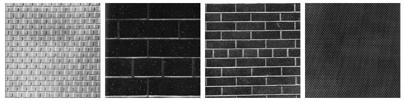
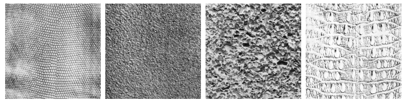
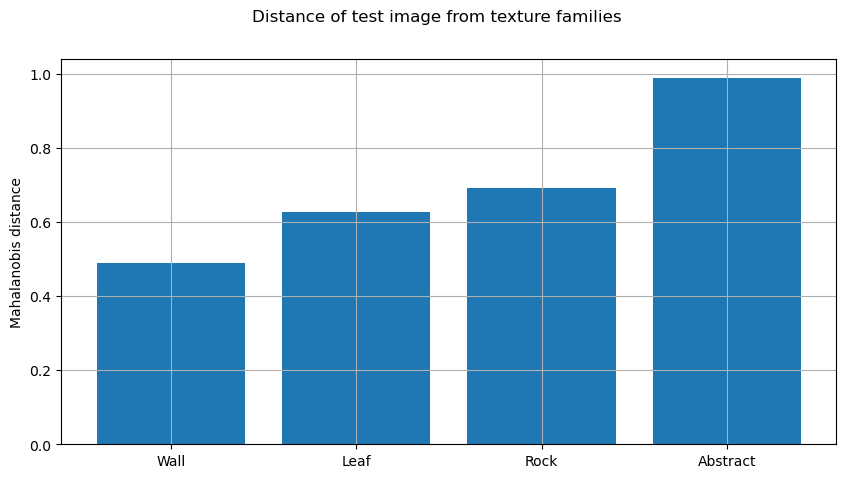
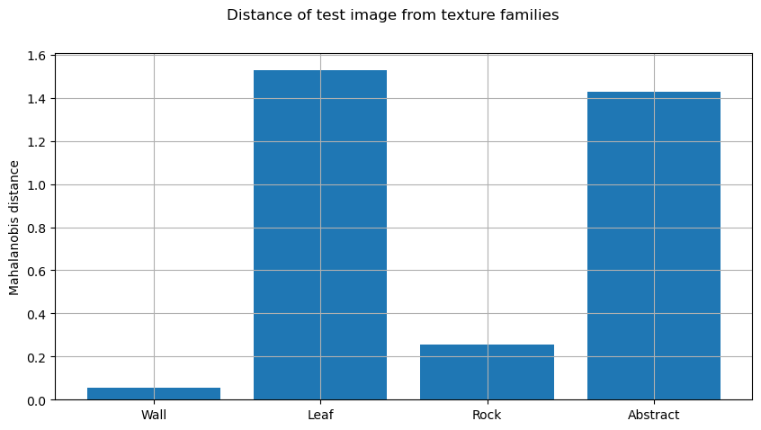

# Texture identification

Texture identification is an important task in computer vision, which
involves analyzing and classifying the patterns and structures present
in an image. Texture is a fundamental characteristic of images and can
provide valuable information for various applications such as object
recognition, segmentation, and classification. There are various
techniques used for texture identification in computer vision, including
statistical analysis, frequency analysis, and texture synthesis. These
techniques rely on extracting texture features from an image and then
using machine learning algorithms to classify the texture. Texture
identification is a challenging problem due to the complexity and
variability of textures in real-world images, and ongoing research aims
to improve the accuracy and efficiency of texture identification
algorithms.

## Objectives

The objectives of this challenge is:

1.  To construct a feature space that can represent each texture family
    by two attribute values. The tools to use are:

    1.  Discrete Fourier Transform (*m*1),

    2.  Auto-correlation (*m*2).

2.  To use the attribute space to model each family by an ellipse with
    its center and semi-axes

3.  To design a distance measure between a new image and a given family
    to classify the new image among the different families.

4.  To consider standard deviations in the distance measure to detect
    family overlapping and give priority to an attribute.

## Discrete Fourier Transform

The Discrete Fourier Transform is a mathematical tool that can be used
to analyze signals, including images. In the context of image
processing, the Fourier Transform can be used to represent an image as a
sum of sinusoidal functions of varying frequencies, amplitudes, and
phases. This representation can be useful for various image processing
tasks, such as image compression, filtering, and feature extraction.  
The discrete Fourier Transform is given as:

$$
    F(u,v)=\frac{1}{MN}\sum_{x=0}^{M-1}\sum_{y=0}^{N-1}f(x,y)\exp\left(-j2\pi\left(\frac{ux}{M}+\frac{vy}{N}\right)\right)$$

Where *F*(*u*,*v*) is the complex-valued Fourier transform of the 2D
discrete signal *f*(*x*,*y*) of size *M* × *N* pixels, and *j* is the
imaginary unit. The Fourier transform gives information about the
frequency components of the image. The inverse Fourier transform can be
used to reconstruct the original image from its frequency components.
The Fast Fourier Transform (FFT) algorithm is commonly used to compute
the Fourier transform efficiently.  
In image analysis, DFT can be used to identify textures and patterns in
different images from different families. Specifically, the DFT function
can be computed for each image, and the resulting frequency spectrum can
be analyzed to identify similarities or differences between the
textures.  
For example, consider two images with different textures, such as a
brick wall and a grassy field. The DFT function for each image would
show distinct frequency components that reflect the underlying texture.
By comparing these frequency spectra, we can identify the unique
features of each texture and distinguish between the two images.

## Auto-correlation

Auto-correlation is a statistical measure that indicates how similar a
signal is to a delayed version of itself. It is commonly used in signal
processing and image analysis to detect patterns and identify
similarities between different samples of a given signal or image.  
The mathematical formula for auto-correlation of a discrete signal or
image can be expressed as:

$$R_{xx}[k] = \frac{1}{N} \sum_{n=0}^{N-1} x[n]x[n-k]$$

Where *x*\[*n*\] represents the input signal or image, *k* is the lag or
delay, and *N* is the length of the signal. The auto-correlation
function *R*<sub>*x**x*</sub>\[*k*\] measures the similarity between the
signal or image and a delayed version of itself at a lag of *k*.  
In image analysis, auto-correlation can be used to identify textures and
patterns in different images from different families. Specifically, the
auto-correlation function can be computed for each image, and the
resulting patterns can be compared to identify similarities or
differences between the textures.  
For example, consider two images with different textures, such as a
brick wall and a grassy field. The auto-correlation function for each
image would show distinct patterns that reflect the underlying texture.
By comparing these patterns, we can identify the unique features of each
texture and distinguish between the two images.

# Methodology

The methodology describes the step-by-step process used to achieve the
objectives of the challenges. In this case, the objective was to develop
a program that could classify an image to a class using the extracted
features.

The following libraries were used:

-   *Numpy*

-   *Open CV*

-   *Matplotlib*

The methodology followed in this challenge includes the following steps:

## Feature Extraction

To extract the features using FFT and auto-correlation, the following
steps are performed:

1.  **Compute the 2D Fourier Transform**: For each image in the list,
    compute the 2D Fourier Transform using the cv2.dft function, which
    returns a complex array of the same size as the input image.

2.  **Compute the power spectrum**: Compute the power spectrum by taking
    the absolute value of the frequency spectrum and squaring it.

3.  **Apply the logarithmic transform**: Apply a logarithmic transform
    to the power spectrum by adding 1 to each element and taking the
    natural logarithm.

4.  **Compute the auto-correlation function**: Compute the
    auto-correlation function using the *cv2.matchTemplate* function,
    which returns a normalized cross-correlation matrix.

5.  **Extract *m*1 and *m*2 features**: Extract two features, m1 and m2,
    from the log-spectrum and auto-correlation matrix, respectively. m1
    is the mean of the logarithmic power spectrum, while m2 is the
    maximum value of the auto-correlation matrix.

In conclusion, the process of extracting the features involves a series
of steps using the Fourier Transform and auto-correlation functions. The
extracted features can then be used for further analysis or
classification purposes.

## Computing the distance

to calculate the Euclidean distance between a new feature and the mean
feature of a family, the following steps are performed:

1.  **Define input parameters**: Define the input parameters for the
    function, which are a numpy array representing the feature of a new
    image, and a numpy array representing the mean feature of a texture
    family.

2.  **Calculate the mean feature** of the texture family using the
    np.mean function and specifying axis=0 to calculate the mean feature
    along the rows.

3.  **Calculate the difference between new feature and mean feature** by
    subtracting the mean feature from the new feature.

4.  **Calculate the Euclidean distance** between the new feature and the
    mean feature of the family using the np.linalg.norm function.

In conclusion the process of finding the distance involves a series of
steps to calculate the Euclidean distance between a new feature and the
mean feature of a texture family. The resulting distances can be used
for classification purposes, where the new feature can be assigned to
the texture family with the smallest distance.

# Results

For our testing, we are using the Brodatz image data-set. We tested our
implementation with several images and obtained promising results.  

## Training data set

For the test, we used the following images:

<figure id="fig:1">
<figure>

<figcaption>Leaf fabric Images</figcaption>
</figure>
<figure>

<figcaption>Rock images</figcaption>
</figure>
<figure>

<figcaption>Wall images</figcaption>
</figure>
<figure>

<figcaption>Abstract images</figcaption>
</figure>
</figure>

For the training data, we used 4 classes which are:

1.  Leaf fabric texture,

2.  Rock/pebble texture,

3.  Wall texture,

4.  Abstract images.

## Abstract texture test Images

Next, we used some test images for classifying them into the defined
families. The results are as bellow:

<figure id="fig:2">
<figure>

<figcaption>Test Image 1 vs feature space</figcaption>
</figure>
<figure>

<figcaption>Test Image 1 distance from the families</figcaption>
</figure>
<figcaption>Test Image 1 - Abstract family</figcaption>
</figure>

<figure id="fig:3">
<figure>

<figcaption>Test Image 2 vs feature space</figcaption>
</figure>
<figure>

<figcaption>Test Image 2 distance from the families</figcaption>
</figure>
<figcaption>Test Image 2 - Abstract family</figcaption>
</figure>

<figure id="fig:4">
<figure>

<figcaption>Test Image 3 vs feature space</figcaption>
</figure>
<figure>

<figcaption>Test Image 3 distance from the families</figcaption>
</figure>
<figcaption>Test Image 3 - Abstract family</figcaption>
</figure>

In the aforementioned figures, namely figure
(<a href="#fig:2" data-reference-type="ref" data-reference="fig:2">2</a>),
figure
(<a href="#fig:3" data-reference-type="ref" data-reference="fig:3">3</a>),
and figure
(<a href="#fig:4" data-reference-type="ref" data-reference="fig:4">4</a>),
we applied images that exhibit visual characteristics akin to those
found in the abstract family, and observed anticipated outcomes.
Specifically, we noted that the images with abstract features possessed
the lowest distance when compared to images belonging to other families,
thereby allowing our algorithm to correctly classify them into the
abstract family on the basis of the feature space. Among the presented
results, Figure
(<a href="#fig:3" data-reference-type="ref" data-reference="fig:3">3</a>)
yielded the most favorable outcomes, whereas Figure
(<a href="#fig:2" data-reference-type="ref" data-reference="fig:2">2</a>)
exhibited the greatest divergence from the abstract family when
juxtaposed with the other images.

Nonetheless, some results were not accurate, as exemplified in Figure
<a href="#fig:5" data-reference-type="ref" data-reference="fig:5">5</a>
bellow. The visual characteristics of the image suggest that it should
be classified into the rock texture family, however, the algorithm
classified it into the abstract family. This can be attributed to two
factors:

1.  Insufficient size of the training dataset. An increase in the size
    of the training dataset is expected to yield improved outcomes.

2.  The feature space is comprised of solely two features, which can
    generate erroneous positives. To enhance the precision of the
    results, we ought to extract more features utilizing more robust
    tools.

<figure id="fig:5">
<figure>

<figcaption>Test Image 4 vs feature space</figcaption>
</figure>
<figure>

<figcaption>Test Image 4 distance from the families</figcaption>
</figure>
<figcaption>Test Image 4 - Abstract family false positive</figcaption>
</figure>

Figure
<a href="#fig:5" data-reference-type="ref" data-reference="fig:5">5</a>
depicts the test image, showcasing the distances from the families. It
is evident that the distance from the abstract family is the lowest,
while that from the rock family is the highest which gives a flase
positive for the abstract class.  

## Wall Texture test Images

Next, we tried test images resembling the wall family. The results are
as bellow:

<figure id="fig:6">
<figure>

<figcaption>Test Image 5 vs feature space</figcaption>
</figure>
<figure>

<figcaption>Test Image 5 distance from the families</figcaption>
</figure>
<figcaption>Test Image 5 - wall family</figcaption>
</figure>

<figure id="fig:7">
<figure>

<figcaption>Test Image 6 vs feature space</figcaption>
</figure>
<figure>

<figcaption>Test Image 6 distance from the families</figcaption>
</figure>
<figcaption>Test Image 6 - wall family</figcaption>
</figure>

<figure id="fig:8">
<figure>

<figcaption>Test Image 7 vs feature space</figcaption>
</figure>
<figure>

<figcaption>Test Image 7 distance from the families</figcaption>
</figure>
<figcaption>Test Image 7 - wall family</figcaption>
</figure>

Upon observation of figure
<a href="#fig:6" data-reference-type="ref" data-reference="fig:6">6</a>,
figure
<a href="#fig:7" data-reference-type="ref" data-reference="fig:7">7</a>,
and figure
<a href="#fig:8" data-reference-type="ref" data-reference="fig:8">8</a>,
we can discern that we applied images displaying wall-like
characteristics, and our algorithm correctly identified and classified
them as belonging to the wall family. Figure
<a href="#fig:7" data-reference-type="ref" data-reference="fig:7">7</a>
produced the most favorable outcomes, whereas figure
<a href="#fig:6" data-reference-type="ref" data-reference="fig:6">6</a>
and figure
<a href="#fig:8" data-reference-type="ref" data-reference="fig:8">8</a>
yielded similar results. A plausible explanation for this outcome can be
attributed to the larger size of the training data-set for the wall
family when compared to the abstract family.

## Leaf Texture test Image

Lastly, we endeavored to utilize a test image sharing visual features
akin to those of the leaf texture family.

<figure id="fig:9">
<figure>

<figcaption>Test Image 8 vs feature space</figcaption>
</figure>
<figure>

<figcaption>Test Image 8 distance from the families</figcaption>
</figure>
<figcaption>Test Image 8 - leaf family</figcaption>
</figure>

As anticipated, the features of the test image were found to exhibit the
lowest distance when compared to the leaf texture family, as depicted in
Figure
(<a href="#fig:9" data-reference-type="ref" data-reference="fig:9">9</a>).
Our algorithm correctly classified this test image as belonging to the
leaf texture family.

# Conclusion

In this challenge, we developed a feature space for texture
identification using the Brodatz database of textures. The feature space
is represented by two attribute values extracted from the two tools,
namely the Discrete Fourier Transform (DFT) and the Autocorrelation.
Using several images for each texture family.  
The code implemented is based on the extraction of features from each
image using FFT and auto-correlation. The Euclidean distance was then
used to calculate the distance between the new feature and the mean
feature of a texture family. The code also includes functions for
plotting images and features, and for calculating and plotting the
distances from the test image to each texture family.  
The developed feature space and distance calculation showed promising
results for texture identification. This approach can be further
improved by using more advanced feature extraction techniques and
classification algorithms. The proposed code can be useful for various
applications such as image recognition, computer vision, and pattern
recognition.  
The code can be seen in Appendix - I

# Appendix - I - Code

## Libraries

``` python
import numpy as np
import cv2
import matplotlib.pyplot as plt
import imageio.v2 as imageio  
```

## Feature Extraction

``` python
def extract_texture_features(imgs):
    """
    Extract texture features using FFT and auto-correlation.

    Args:
        imgs: A list of images.

    Returns:
        feature_vectors: A numpy array of size (N, 2) containing extracted features for N images.
    """
    # Step 2-6: Extract features from each image
    m1_values = []
    m2_values = []
    for img in imgs:
        # Step 2: Compute the 2D Fourier Transform
        fft = cv2.dft(np.float32(img), flags=cv2.DFT_COMPLEX_OUTPUT)
        freq_spectrum = np.fft.fftshift(fft)

        # Step 3: Compute the power spectrum
        power_spectrum = np.abs(freq_spectrum) ** 2

        # Step 4: Apply the logarithmic transform
        log_spectrum = np.log(1 + power_spectrum)

        # Step 5: Compute the autocorrelation function
        autocorr = cv2.matchTemplate(img, img, cv2.TM_CCORR_NORMED)

        # Step 6: Extract m1 and m2 features
        m1 = np.mean(log_spectrum)
        m2 = np.max(autocorr)
        m1_values.append(m1)
        m2_values.append(m2)

    feature_vectors = np.column_stack((m1_values, m2_values))
    
    return feature_vectors
```

## Distance calculation

``` python
 def distance(new_feature, family_feature):
    """
    Calculate the Euclidean distance between a new feature and the mean feature of a family.

    Args:
        new_feature: A numpy array representing the feature of a new image.
        family_feature: A numpy array representing the mean feature of a texture family.

    Returns:
        A numpy array containing the Euclidean distances between
        the new feature and each feature in the family.
    """
    return np.linalg.norm(new_feature - np.mean(family_feature, axis=0), axis=1)
```

## Plotting

### Plotting Images

``` python
def plot_images(images, title):
    """
    Plot a set of images in a grid with a shared title.

    Args:
        images (list): A list of image file paths to be plotted.
        title (str): The title to be displayed above the grid of images.

    Returns:
        None.
    """
    plt.figure(figsize=(10, 5))
    plt.suptitle(title)
    for i, img_path in enumerate(images):
        img = imageio.imread(img_path)
        plt.subplot(1, len(images), i+1)
        plt.imshow(img, cmap='gray')
        plt.axis('off')
    plt.subplots_adjust(wspace=0.05, hspace=0.05)
    plt.show()
```

### Plotting Test Image against Feature Space

``` python
def plot_test_image(new_image, new_features, wall_features,\
leaf_features, family1_features, family2_features):
    """
    Plot a test image and its feature vector alongside other texture families.

    Args:
    new_image (numpy.ndarray): The test image to be plotted.
    new_features (list): A list of tuples containing the mean DFT power spectrum and
                         peak auto-correlation values for the test image.
    wall_features (numpy.ndarray): A 2D array of mean DFT power spectrum and peak
                                    auto-correlation values for the wall texture family.
    leaf_features (numpy.ndarray): A 2D array of mean DFT power spectrum and peak
                                    auto-correlation values for the leaf texture family.
    family1_features (numpy.ndarray): A 2D array of mean DFT power spectrum and peak
                                        auto-correlation values for the rock texture family.
    family2_features (numpy.ndarray): A 2D array of mean DFT power spectrum and peak
                                        auto-correlation values for the abstract texture family.

    Returns:
    None
    """
    plt.figure(figsize=(10, 5))
    plt.suptitle('Test image and its feature vector')
    plt.subplot(1, 2, 1)
    plt.imshow(new_image, cmap='gray')
    plt.axis('off')
    plt.subplot(1, 2, 2)
    plt.plot(new_features[0][0], new_features[0][1], 'ro', label='Test image')
    plt.plot(wall_features[:, 0], wall_features[:, 1], 'bx', label='Wall texture family')
    plt.plot(leaf_features[:, 0], leaf_features[:, 1], 'gx', label='Leaf texture family')
    plt.plot(family1_features[:, 0], family1_features[:, 1], 'mx', label='Rock texture family')
    plt.plot(family2_features[:, 0], family2_features[:, 1], 'yx', label='Abstract texture family')
    plt.xlabel('Mean DFT power spectrum')
    plt.ylabel('Peak Auto-Correlation')
    plt.grid(True)
    plt.legend()
    plt.subplots_adjust(wspace=0.2, hspace=0.25)
    plt.show()
```

### Plotting Distance for test image against each Family

``` python
def plot_distances(wall_distance, leaf_distance, family1_distance, family2_distance):
    """
    Plot the Mahalanobis distances of a test image from different texture families.

    Parameters:
    -----------
    wall_distance: float
        Mahalanobis distance of the test image from the wall texture family.
    leaf_distance: float
        Mahalanobis distance of the test image from the leaf texture family.
    family1_distance: float
        Mahalanobis distance of the test image from the rock texture family.
    family2_distance: float
        Mahalanobis distance of the test image from the abstract texture family.

    Returns:
    --------
    None
    """
    plt.figure(figsize=(10, 5))
    plt.suptitle('Distance of test image from texture families')
    plt.bar(['Wall', 'Leaf', 'Rock', 'Abstract'], [wall_distance,\
            leaf_distance, family1_distance, family2_distance])
    
    plt.ylabel('Mahalanobis distance')
    plt.subplots_adjust(wspace=0.2, hspace=0.25)
    plt.grid()
    plt.show()
```

### Main Plotting Function

``` python
def plot_texture_classification(wall_images, leaf_images, family1_images,\
family2_images, new_image, wall_features, leaf_features,\
family1_features, family2_features, new_features,\
wall_distance, leaf_distance, family1_distance, family2_distance):

    # Plot wall images
    plot_images(wall_images, 'Wall texture images')

    # Plot leaf images
    plot_images(leaf_images, 'Leaf texture images')

    # Plot family1 images
    plot_images(family1_images, 'Rock texture images')

    # Plot family2 images
    plot_images(family2_images, 'Abstract texture images')

    # Plot test image and its feature vector
    plot_test_image(new_image, new_features,\
            wall_features, leaf_features,\
            family1_features, family2_features)

    # Plot distances
    plot_distances(np.mean(wall_distance), \
            np.mean(leaf_distance), np.mean(family1_distance), \
            np.mean(family2_distance))
```

## Main Body

``` python
# load the training images for each group
wall_images = ['Brodatz/D1.gif', 'Brodatz/D25.gif', 'Brodatz/D26.gif', 'Brodatz/D6.gif']
leaf_images = ['Brodatz/D40.gif', 'Brodatz/D41.gif']
rocks_images = ['Brodatz/D30.gif', 'Brodatz/D31.gif', 'Brodatz/D23.gif']
abstract_images = ['Brodatz/D3.gif', 'Brodatz/D4.gif', 'Brodatz/D5.gif', 'Brodatz/D10.gif']

wall_features = extract_texture_features([imageio.imread(img) for img in wall_images])
leaf_features = extract_texture_features([imageio.imread(img) for img in leaf_images])
rocks_features = extract_texture_features([imageio.imread(img) for img in rocks_images])
abstract_features = extract_texture_features([imageio.imread(img) for img in abstract_images])

# Step 7: Identify the texture family of a new 
#image based on its distance from the different families

test_image_path = 'Brodatz/D96.gif'
new_image = imageio.imread(test_image_path)
new_features = extract_texture_features([new_image])

# Calculate the distances between the new image and each texture family
wall_distance = distance(new_features, wall_features)
leaf_distance = distance(new_features, leaf_features)
rock_distance = distance(new_features, rocks_features)
abstract_distance = distance(new_features, abstract_features)

# Assign the new image to the family with the minimum distance
distances = [np.min(wall_distance), \
    np.min(leaf_distance), np.min(rock_distance), \
    np.min(abstract_distance)]
family_names = ['Wall', 'Leaf', 'rock', 'abstract']
min_distance = min(distances)
min_index = distances.index(min_distance)
family_name = family_names[min_index]


plot_texture_classification(wall_images, leaf_images, \
    rocks_images, abstract_images, new_image, \
    wall_features, leaf_features, rocks_features, \
    abstract_features, new_features, wall_distance, \
    leaf_distance, rock_distance, abstract_distance)
    
print('The test image', test_image_path, 'belongs to the', family_name, 'texture family.')
```

# Appendix - II - References

\[1\] J. Malik and P. Perona, "Preattentive texture discrimination with
early vision mechanisms," Journal of the Optical Society of America A,
vol. 7, no. 5, pp. 923-932, May 1990.  
\[2\] M. Varma and A. Zisserman, "Texture classification: Are filter
banks necessary?," in IEEE Conference on Computer Vision and Pattern
Recognition, vol. 2, 2003, pp. II-691-II-698.  
\[3\] S. D. Bay and T. Tuytelaars, "SURF: Speeded Up Robust Features,"
in European Conference on Computer Vision, 2006, pp. 404-417.  
\[4\] G. Sharma, K. Gupta, and P. Singh, "A Survey of Texture
Classification Methods Based on Local Binary Patterns," in International
Journal of Computer Applications, vol. 169, no. 2, 2017, pp. 6-11.  
\[5\] J. Daugman, "Complete discrete 2-D Gabor transforms by neural
networks for image analysis and compression," IEEE Transactions on
Acoustics, Speech, and Signal Processing, vol. 36, no. 7, pp. 1169-1179,
Jul 1988.  
\[6\] R. C. Gonzalez and R. E. Woods, Digital Image Processing, 4th ed.
Pearson, 2018.  
[BRODATZ’S TEXTURE
DATABASE](https://multibandtexture.recherche.usherbrooke.ca/original_brodatz.html)
