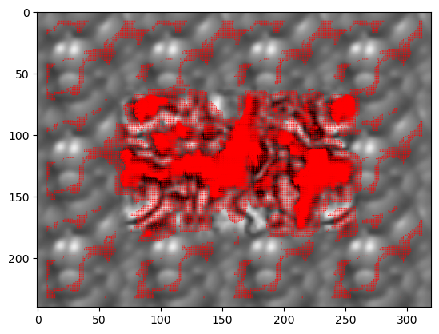
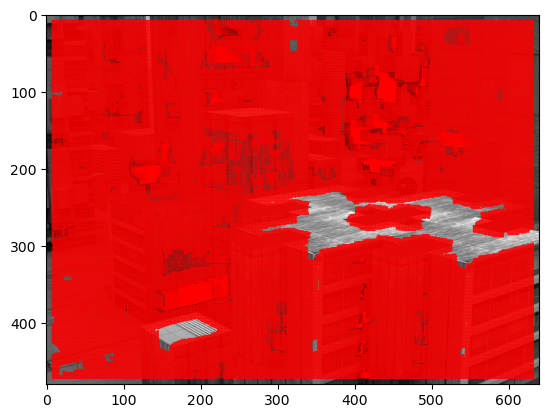
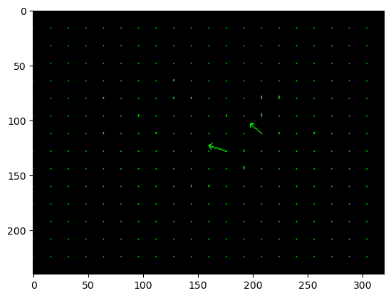
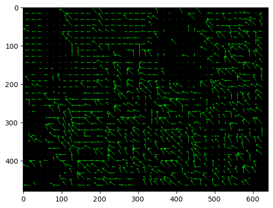

# **2D motion Estimation**

# Subject and Objective

## Motion Estimation

2D motion estimation is an important task in computer vision that
involves analyzing a sequence of 2D images to estimate the motion of
objects in the scene. This can be achieved by tracking features in
successive frames and computing the displacement between them, or by
using dense optical flow techniques to estimate motion at every pixel.
The resulting motion estimates can be used for a variety of applications
such as object tracking, video stabilization, and action recognition.
However, accurate motion estimation can be challenging due to issues
such as occlusions, camera motion, and complex object motion, and
therefore requires sophisticated algorithms and techniques.

## Objectives

The objectives of this challenge is:

1.  Estimate 2D motion using:

    1.  Optical flow

    2.  Block Correlation

2.  Apply the algorithm on two test cases:

    1.  Camera movement

    2.  Object movement

# Methodology

The methodology describes the step-by-step process used to achieve the
objectives of the challenges. In this case, the objective was to develop
a program that could estimate 2D motion.

The following libraries were used:

-   *Numpy*

-   *Open CV*

-   *Matplotlib*

The methodology followed in this challenge includes the following steps:

## Optical Flow - Lucas Kanade

Optical flow is a technique used in computer vision to estimate the
motion of objects in a scene by analyzing the movement of pixels between
consecutive frames of a video. It assumes that the movement of pixels
between frames is smooth and continuous, and uses this assumption to
calculate the velocity of each pixel in the image. Lucas Kanade is a
popular optical flow algorithm that uses a local method to estimate the
motion of pixels. It assumes that the motion of pixels in a small
neighborhood of an image is constant, and uses this assumption to solve
a system of linear equations to estimate the velocity of each pixel. The
Lucas Kanade algorithm is widely used for tasks such as image
stabilization, object tracking, and robot navigation, and has been
extended in various ways to address its limitations, such as using
pyramids to handle large motion or incorporating temporal information to
handle motion blur.

The algorithm can be described as follows:  

1.  Given two consecutive frames *I*(*x*,*y*,*t*) and
    *I*(*x*,*y*,*t*+1), compute the spatial and temporal derivatives of
    the first frame:
    $$\begin{aligned}
                I_x(x,y) &= \frac{\partial I}{\partial x}(x,y,t) \\
                I_y(x,y) &= \frac{\partial I}{\partial y}(x,y,t) \\
                I_t(x,y) &= I(x,y,t+1) - I(x,y,t)
            
    \end{aligned}$$

2.  Choose a window centered at pixel (*x*<sub>0</sub>,*y*<sub>0</sub>)
    with size *w* × *w*, and define the image patch in this window as
    *I*(*x*,*y*).

3.  Compute the spatial derivatives of the patch *I*(*x*,*y*):
    $$\begin{aligned}
                \nabla I &= \begin{bmatrix}
                I_x(x_0,y_0) & I_y(x_0,y_0) \\
                I_x(x_0+1,y_0) & I_y(x_0+1,y_0) \\
                \vdots & \vdots \\
                I_x(x_0+w-1,y_0+w-1) & I_y(x_0+w-1,y_0+w-1)
                \end{bmatrix}
            
    \end{aligned}$$

4.  Compute the temporal derivative of the patch *I*(*x*,*y*):
    $$\begin{aligned}
                I_t &= \begin{bmatrix}
                I_t(x_0,y_0) \\
                I_t(x_0+1,y_0) \\
                \vdots \\
                I_t(x_0+w-1,y_0+w-1)
                \end{bmatrix}
            
    \end{aligned}$$

5.  Compute the gradient of the patch ∇*I*.

6.  Compute the matrix *A* and the vector *b* for the least square fit:
    $$\begin{aligned}
                A &= \nabla I^\top \nabla I \\
                b &= -\nabla I^\top I_t
            
    \end{aligned}$$

7.  Solve the equation *A**Δ**p* = *b* using the pseudo-inverse of *A*,
    where *Δ**p* is the motion vector:
    $$\begin{aligned}
                \Delta p &= (A^\top A)^{-1}A^\top b
            
    \end{aligned}$$

8.  Update the motion vector:
    $$\begin{aligned}
                p\_{\text{new}} &= p + \Delta p
            
    \end{aligned}$$

9.  Repeat steps 2 to 8 until convergence.

10. Output the final motion vector *p*<sub>new</sub>.

## Block Reduction

Block correlation is a technique used in computer vision and motion
detection to estimate the motion of objects in a sequence of images. It
involves dividing the image into blocks or patches and computing the
correlation between these blocks in successive frames to estimate the
displacement of the objects.  
Here are the steps of the block correlation algorithm:

1.  Given two consecutive frames *I*(*x*,*y*,*t*) and
    *I*(*x*,*y*,*t*+1), divide the frames into blocks or patches of size
    *w* × *w* pixels.

2.  For each block in the first frame, compute the sum of squared
    differences (SSD) between the pixel values of the block and each
    block in a search area of size *S* × *S* pixels in the second frame:
    $$\begin{aligned}
            \text{SSD}(x,y,\Delta x,\Delta y) &= \sum_{i=0}^{w-1}\sum_{j=0}^{w-1} [I(x+i,y+j,t) - I(x+i+\Delta x, y+j+\Delta y,t+1)]^2
        
    \end{aligned}$$

3.  Find the block in the search area with the minimum SSD:
    $$\begin{aligned}
            (\Delta x, \Delta y) &= \arg\min\_{\Delta x, \Delta y} \text{SSD}(x,y,\Delta x,\Delta y)
        
    \end{aligned}$$

4.  Store the displacement vector (*Δ**x*,*Δ**y*) for the current block.

5.  Repeat steps 2 to 4 for all blocks in the first frame.

6.  Output the displacement vectors for all blocks as the estimated
    motion vectors for the objects in the frames.

# Results

For our testing, we used two types of image sequences. One where the
object moves while the camera is stationary and the other being where
the camera moves while the objects are stationary. Bellow are the images
used:

<figure id="fig:1">
<figure>

<figcaption>Frame 1</figcaption>
</figure>
<figure>

<figcaption>Frame 2</figcaption>
</figure>
<figcaption>Object Movement</figcaption>
</figure>

In the above figures
(<a href="#fig:1" data-reference-type="ref" data-reference="fig:1">1</a>),
a synthetic image sequence is shown where in the second frame, the
center pixels move 2 pixels to the right

<figure id="fig:2">
<figure>

<figcaption>Frame 1</figcaption>
</figure>
<figure>

<figcaption>Frame 2</figcaption>
</figure>
<figcaption>Object Movement</figcaption>
</figure>

In the above figures
(<a href="#fig:2" data-reference-type="ref" data-reference="fig:2">2</a>),
a rendered image sequence is shown where in the second frame, the camera
is moved to the right.

## Lucas Kanade

The results of the Lucas Kanade algorithm on the above two image
sequences are:

<figure id="fig:3">
<figure>

<figcaption>Object movement</figcaption>
</figure>
<figure>

<figcaption>Camera Movement</figcaption>
</figure>
<figcaption>Lucas Kanade Result</figcaption>
</figure>

In the above figure
(<a href="#fig:3" data-reference-type="ref" data-reference="fig:3">3</a>),
the left image shoes the result when the object moves while the image at
the right shows when the camera moves.

## Block correlation

The results of the Block correlation algorithm on the two image
sequences are:

<figure id="fig:4">
<figure>

<figcaption>Object movement</figcaption>
</figure>
<figure>

<figcaption>Camera Movement</figcaption>
</figure>
<figcaption>Block Correlation Result</figcaption>
</figure>

In the above figure
(<a href="#fig:4" data-reference-type="ref" data-reference="fig:4">4</a>),
the left image shoes the result when the object moves while the image at
the right shows when the camera moves.

# Comparison between **LK** and **BC**

Lucas-Kanade (LK) and Block Correlation (BC) are two popular techniques
for estimating 2D motion in computer vision. While both techniques aim
to estimate the motion of objects in a sequence of images, they have
some fundamental differences in their approach.  
Lucas-Kanade is an iterative algorithm that uses the partial derivatives
of the image to estimate the optical flow, which represents the apparent
motion of objects in an image. The algorithm seeks to minimize the sum
of squared differences between the pixel values of a local neighborhood
in the first image and a corresponding neighborhood in the second image.
LK can be used in a variety of scenarios, including video stabilization,
object tracking, and image registration. LK is particularly useful when
the motion is small and the brightness of the objects remains relatively
constant between frames.  
Block Correlation, on the other hand, is a non-iterative technique that
divides the images into small blocks and seeks to find the block with
the closest match between the two frames. This is done by computing a
similarity metric, such as the sum of squared differences or normalized
cross-correlation, between each block in the first image and a
corresponding block in the second image. The motion vector is then
estimated by the displacement of the block with the highest similarity.
BC is particularly useful when the motion is large and the objects being
tracked have low spatial frequency.  
The choice between LK and BC depends on the specific requirements of the
application. LK is suitable for tracking small motion, where the
brightness of the objects remains relatively constant. On the other
hand, BC is more suitable for tracking large motion, where the objects
have low spatial frequency. Additionally, LK is an iterative algorithm
that can be computationally expensive, especially for large images or
long sequences. In contrast, BC is a non-iterative algorithm that can be
implemented efficiently and is less computationally expensive.  
In summary, both LK and BC are popular techniques for estimating 2D
motion in computer vision. The choice between the two depends on the
specific requirements of the application, such as the size and nature of
the motion, the spatial frequency of the objects, and the computational
resources available.

# Conclusion

In this challenge, we used two approaches to estimate 2D motion. One
being optical flow and the other being block correlation.  
In general, Lucas-Kanade is more suitable for small and smooth motions,
while block correlation is better suited for larger and more complex
motions. However, the choice between the two methods ultimately depends
on the specific application and the characteristics of the images being
analyzed, and often a combination of the two methods is used to achieve
robust and accurate motion estimation.

The code can be seen in Appendix - I

# Appendix - I - Code

## Libraries

``` python
import numpy as np
import cv2
import matplotlib.pyplot as plt
```

## Lucas Kanade

``` python
def lucas_kanade(prev_img, curr_img, window_size=15):
    # Define the gradient kernels
    gradient_x = np.array([[-1, 1], [-1, 1]])
    gradient_y = np.array([[-1, -1], [1, 1]])
    gradient_t = np.array([[-1, -1], [-1, -1]])

    # Calculate the image gradients
    I_x = cv2.filter2D(prev_img, -1, gradient_x) + cv2.filter2D(curr_img, -1, gradient_x)
    I_y = cv2.filter2D(prev_img, -1, gradient_y) + cv2.filter2D(curr_img, -1, gradient_y)
    I_t = cv2.filter2D(prev_img, -1, gradient_t) + cv2.filter2D(curr_img, -1, -gradient_t)

    # Define the window for computing the optical flow
    half_window = window_size // 2

    # Initialize the motion flow vectors to zero
    motion_flow = np.zeros(prev_img.shape + (2,))

    # Loop over all pixels in the image
    for i in range(half_window, prev_img.shape[0] - half_window):
        for j in range(half_window, prev_img.shape[1] - half_window):
            # Extract the image patch around the pixel
            I_x_patch = I_x[i - half_window:i + half_window + 1,\
                        j - half_window:j + half_window + 1].flatten()
            I_y_patch = I_y[i - half_window:i + half_window + 1,\
                        j - half_window:j + half_window + 1].flatten()
            I_t_patch = I_t[i - half_window:i + half_window + 1,\
                        j - half_window:j + half_window + 1].flatten()

            # Compute the optical flow using the least-squares method
            A = np.stack((I_x_patch, I_y_patch), axis=-1)
            b = -I_t_patch
            v, _, _, _ = np.linalg.lstsq(A, b, rcond=None)
            motion_flow[i, j] = v

    return motion_flow
```

## Block Correlation

``` python
def calculate_motion_flow(frame1, frame2, block_size, search_range):
    # Convert frames to grayscale
    gray1 = cv2.cvtColor(frame1, cv2.COLOR_BGR2GRAY)
    gray2 = cv2.cvtColor(frame2, cv2.COLOR_BGR2GRAY)

    # Define motion vector field
    motion_flow = np.zeros_like(frame1)

    # Divide first frame into blocks
    for i in range(0, gray1.shape[0], block_size):
        for j in range(0, gray1.shape[1], block_size):
            # Define current block
            block1 = gray1[i:i+block_size, j:j+block_size]

            # Define search area in second frame
            top = max(i-search_range, 0)
            bottom = min(i+search_range, gray2.shape[0])
            left = max(j-search_range, 0)
            right = min(j+search_range, gray2.shape[1])
            search_area = gray2[top:bottom, left:right]

            # Calculate correlation between block and search area
            corr = cv2.matchTemplate(search_area, block1, cv2.TM_CCORR_NORMED)

            # Find location of maximum correlation
            y, x = np.unravel_index(np.argmax(corr), corr.shape)

            # Calculate motion vector
            dx = x + left - j
            dy = y + top - i

            # Draw motion vector on image
            cv2.arrowedLine(motion_flow, (j, i), (j+dx, i+dy), (0, 255, 0), 1, tipLength=0.2)
    
    return motion_flow
```

## Main body

### Lucas Kanade

``` python
# Load the previous and current images
prev_img = cv2.imread('input_images/Urban2/urban01.png', cv2.IMREAD_GRAYSCALE)
curr_img = cv2.imread('input_images/Urban2/urban02.png', cv2.IMREAD_GRAYSCALE)

# Compute the motion flow using Lucas-Kanade algorithm
motion_flow = lucas_kanade(prev_img, curr_img)

# Plot the non-zero motion flow vectors using matplotlib
y, x = np.mgrid[0:curr_img.shape[0], 0:curr_img.shape[1]]
mag = np.linalg.norm(motion_flow, axis=-1)
mask = mag > 0.1  # Define a threshold to filter out low-magnitude vectors
plt.imshow(curr_img, cmap='gray')
plt.quiver(x[mask], y[mask], motion_flow[..., 0][mask], motion_flow[..., 1][mask], color='r')
plt.show()
```

### Block Correlation

``` python
# Read two consecutive frames
frame1 = cv2.imread('input_images/Urban2/urban01.png')
frame2 = cv2.imread('input_images/Urban2/urban02.png')
        
# Define block size and search range
block_size = 16
search_range = 16

# Calculate motion flow
motion_flow = calculate_motion_flow(frame1, frame2, block_size, search_range)

# Display motion vector field
import matplotlib.pyplot as plt
plt.imshow(cv2.cvtColor(motion_flow, cv2.COLOR_BGR2RGB))
plt.show()
```

# Appendix - II - References

\[1\] Lucas, B.D. and Kanade, T., "An Iterative Image Registration
Technique with an Application to Stereo Vision", Proceedings of the 7th
International Joint Conference on Artificial Intelligence, Vancouver,
BC, Canada, pp. 674-679, 1981..  
\[2\] Bouguet, J.Y., "Pyramidal Implementation of the Lucas Kanade
Feature Tracker", Intel Corporation, Microprocessor Research Labs,
1999.  
\[3\] Tomasi, C. and Kanade, T., "Detection and Tracking of Point
Features", Carnegie Mellon University Technical Report CMU-CS-91-132,
April 1991.  
\[4\]Horn, B.K.P. and Schunck, B.G., "Determining Optical Flow",
Artificial Intelligence, Vol. 17, No. 1-3, pp. 185-203, 1981.  
\[5\] Burt, P.J. and Adelson, E.H., "The Laplacian Pyramid as a Compact
Image Code", IEEE Transactions on Communications, Vol. COM-31, No. 4,
pp. 532-540, April 1983.  
\[6\] Szeliski, R., "Computer Vision: Algorithms and Applications",
Springer, 2011.  
[Optical Flow by Dr. Mubarak
Shah](https://www.youtube.com/watch?v=5VyLAH8BhF8&list=PLd3hlSJsX_Imk_BPmB_H3AQjFKZS9XgZm&index=8&t=2783s)
